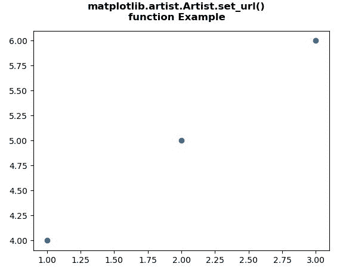

# Python 中的 matplotlib . artist . artist . set _ URL()

> 原文:[https://www . geesforgeks . org/matplotlib-artist-artist-set _ URL-in-python/](https://www.geeksforgeeks.org/matplotlib-artist-artist-set_url-in-python/)

[**【Matplotlib】**](https://www.geeksforgeeks.org/python-introduction-matplotlib/)是 Python 中的一个库，它是 NumPy 库的数字-数学扩展。 **艺术家类** 包含将渲染到图形画布中的对象的抽象基类。图形中所有可见的元素都是艺术家的子类。

## matplotlib . artist . artist . set _ URL()方法

matplotlib 库的艺术家模块中的 **set_url()方法**用于设置艺术家的 url。

> ***句法:*** 艺术家。 *set_url(self，url)*
> 
> ***参数:**此方法只接受一个参数。*
> 
> *   ***url :** 这个参数是包含 url 的字符串。*
> 
> ***返回:**该方法不返回值。*

下面的例子说明了 matplotlib . artist . artist .set _ URL()函数在 matplotlib 中的作用:

**例 1:**

```
# Implementation of matplotlib function
from matplotlib.artist import Artist 
import numpy as np 
import matplotlib.cm as cm 
import matplotlib.mlab as mlab 
import matplotlib.pyplot as plt

f, ax = plt.subplots() 
s = ax.scatter([1, 2, 3], [4, 5, 6])
Artist.set_url(s, 'http://www.google.com') 
f.canvas.print_figure('geeks1.svg')

f.suptitle("""matplotlib.artist.Artist.set_url()
function Example""", fontweight="bold")

plt.show()
```

**输出:**



**例 2:**

```
# Implementation of matplotlib function
from matplotlib.artist import Artist 
import numpy as np 
import matplotlib.cm as cm 
import matplotlib.mlab as mlab 
import matplotlib.pyplot as plt 

f, ax = plt.subplots() 
delta = 0.025

x = y = np.arange(-3.0, 3.0, delta) 
X, Y = np.meshgrid(x, y) 

Z1 = np.exp(-X**2 - Y**2) 
Z2 = np.exp(-(X - 1)**2 - (Y - 1)**2) 
Z = (Z1 - Z2) * 2

im = ax.imshow(Z, 
               interpolation ='bilinear', 
               cmap = "bone", 
               origin ='lower',  
               extent =[-3, 3, -3, 3]) 

Artist.set_url(im, 'https://www.geeksforgeeks.org/') 
f.canvas.print_figure('geeks2.svg')

f.suptitle("""matplotlib.artist.Artist.set_url()
function Example""", fontweight="bold")

plt.show()
```

**输出:**

