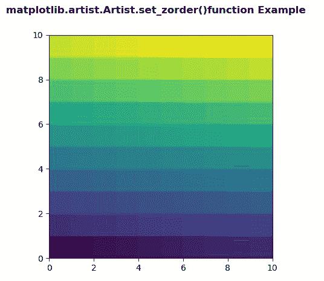
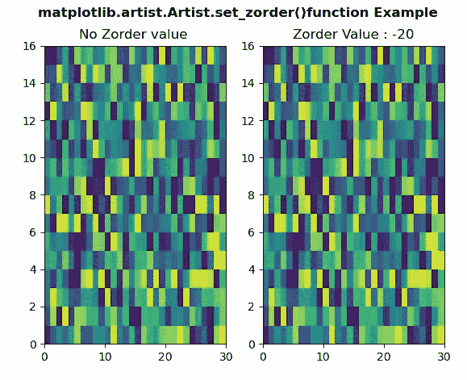

# Python 中的 matplotlib . artist . artist . set _ zorder()

> 原文:[https://www . geesforgeks . org/matplotlib-artist-artist-set _ zorder-in-python/](https://www.geeksforgeeks.org/matplotlib-artist-artist-set_zorder-in-python/)

**[Matplotlib](https://www.geeksforgeeks.org/python-introduction-matplotlib/)** 是 Python 中的一个库，是 NumPy 库的数值-数学扩展。**艺术家类**包含抽象基类，用于渲染到图形画布中的对象。图形中所有可见的元素都是艺术家的子类。

## matplotlib . artist . artist . set _ zorder()方法

matplotlib 库的 artist 模块中的 **set_zorder()方法**用于为艺术家设置 zorder。

> **语法:** Artist.set_zorder(自我，等级)
> 
> **参数:**该方法接受以下参数。
> 
> *   **级别:**该参数包含浮点值。
> 
> **返回:**该方法不返回值。

以下示例说明了 matplotlib 中的 matplotlib . artist . artist . set _ zorder()函数:

**例 1:**

```
# Implementation of matplotlib function
from matplotlib.artist import Artist  
import numpy as np 
import matplotlib.pyplot as plt 

d = np.arange(100).reshape(10, 10) 
xx, yy = np.meshgrid(np.arange(11), np.arange(11)) 

fig, ax = plt.subplots() 

ax.set_aspect(1) 
m = ax.pcolormesh(xx, yy, d)

Artist.set_zorder(m, -15)

fig.suptitle('matplotlib.artist.Artist.set_zorder()\
function Example', fontweight ="bold") 

plt.show()
```

**输出:**


**例 2:**

```
# Implementation of matplotlib function
from matplotlib.artist import Artist  
import numpy as np 
import matplotlib.pyplot as plt 

xx = np.random.rand(16, 30) 

fig, (ax3, ax4) = plt.subplots(1, 2) 

m = ax3.pcolor(xx) 

ax3.set_title("No Zorder value ") 

m = ax4.pcolor(xx) 
Artist.set_zorder(m, -20) 

ax4.set_title("Zorder Value : -20") 

fig.suptitle('matplotlib.artist.Artist.set_zorder()\
function Example', fontweight ="bold") 

plt.show()
```

**输出:**
