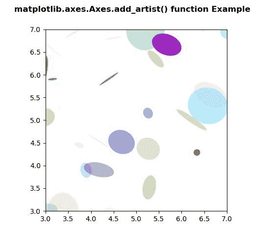

# Python 中的 matplotlib . axes . axes . add _ artist()

> 原文:[https://www . geeksforgeeks . org/matplotlib-axes-axes-add _ artist-in-python/](https://www.geeksforgeeks.org/matplotlib-axes-axes-add_artist-in-python/)

**[Matplotlib](https://www.geeksforgeeks.org/python-introduction-matplotlib/)** 是 Python 中的一个库，是 NumPy 库的数值-数学扩展。**轴类**包含了大部分的图形元素:轴、刻度、线二维、文本、多边形等。，并设置坐标系。Axes 的实例通过回调属性支持回调。

## matplotlib . axes . axes . add _ artist()函数

matplotlib 库的 Axes 模块中的 **Axes.add_artist()函数**用于给轴添加一个 artist，并返回 Artist。

> **语法:** Axes.add_artist(self，a)
> 
> **参数:**该方法接受以下参数。
> 
> *   **a:** 该参数为**图例**，由图例()功能产生。
> 
> **返回值:**此方法返回艺术家。

下面的例子说明了 matplotlib.axes 中的`matplotlib.axes.Axes.add_artist()`函数:

**例 1:**

```
# Implementation of matplotlib function
import numpy as np
np.random.seed(19680801)
import matplotlib.pyplot as plt

volume = np.random.rayleigh(27, size = 40)
amount = np.random.poisson(10, size = 40)
ranking = np.random.normal(size = 40)
price = np.random.uniform(1, 10, size = 40)

fig, ax = plt.subplots()

scatter = ax.scatter(volume * 2, amount * 3,
                     c = ranking * 3, 
                     s = 0.3*(price * 3)**2,
                     vmin =-4, vmax = 4,
                     cmap ="Spectral")

legend1 = ax.legend(*scatter.legend_elements(num = 5),
                    loc ="upper left", 
                    title ="Ranking")

ax.add_artist(legend1)

kw = dict(prop ="sizes", num = 5,
          color = scatter.cmap(0.7),
          fmt =" {x:.2f}",
          func = lambda s: np.sqrt(s/.3)/3)

legend2 = ax.legend(*scatter.legend_elements(**kw),
                    loc ="lower right",
                    title ="Size")

fig.suptitle('matplotlib.axes.Axes.add_artist() \
function Example\n\n', fontweight ="bold")
plt.show()
```

**输出:**


**例 2:**

```
# Implementation of matplotlib function
import matplotlib.pyplot as plt
import numpy as np
from matplotlib.patches import Ellipse

NUM = 200

ells = [Ellipse(xy = np.random.rand(2) * 10,
                width = np.random.rand(),
                height = np.random.rand(),
                angle = np.random.rand() * 360)
        for i in range(NUM)]

fig, ax = plt.subplots(subplot_kw ={'aspect': 'equal'})

for e in ells:
    ax.add_artist(e)
    e.set_clip_box(ax.bbox)
    e.set_alpha(np.random.rand())
    e.set_facecolor(np.random.rand(4))

ax.set_xlim(3, 7)
ax.set_ylim(3, 7)

fig.suptitle('matplotlib.axes.Axes.add_artist() \
function Example\n\n', fontweight ="bold")

plt.show()
```

**输出:**
