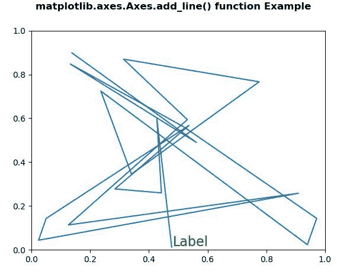
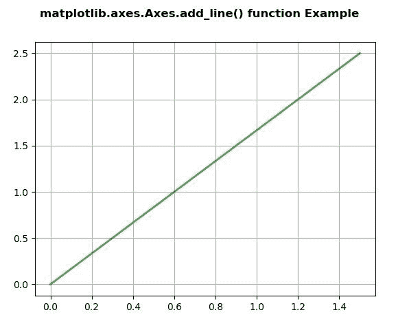

# Python 中的 Matplotlib.axes.Axes.add_line()

> 原文:[https://www . geeksforgeeks . org/matplotlib-axes-axes-add _ line-in-python/](https://www.geeksforgeeks.org/matplotlib-axes-axes-add_line-in-python/)

**[Matplotlib](https://www.geeksforgeeks.org/python-introduction-matplotlib/)** 是 Python 中的一个库，是 NumPy 库的数值-数学扩展。**轴类**包含了大部分的图形元素:轴、刻度、线二维、文本、多边形等。，并设置坐标系。Axes 的实例通过回调属性支持回调。

## matplotlib.axes.Axes.add_line()函数

matplotlib 库的 Axes 模块中的 **Axes.add_line()函数**用于在轴的直线上添加一条直线 2d；回线。

> **语法:** Axes.add_line(self，line)
> 
> **参数:**该方法接受以下参数。
> 
> *   **线:**该参数为线 2D。
> 
> **返回值:**此方法返回该行。

下面的例子说明了 matplotlib.axes 中的`matplotlib.axes.Axes.add_line()`函数:

**例 1:**

```
# Implementation of matplotlib function
import numpy as np
import matplotlib.pyplot as plt
import matplotlib.lines as lines
import matplotlib.transforms as mtransforms
import matplotlib.text as mtext

class GFGfun(lines.Line2D):
    def __init__(self, *args, **kwargs):
        self.text = mtext.Text(0, 0, '')
        lines.Line2D.__init__(self, *args, **kwargs)
        self.text.set_text(self.get_label())

    def set_figure(self, figure):
        self.text.set_figure(figure)
        lines.Line2D.set_figure(self, figure)

    def set_axes(self, axes):
        self.text.set_axes(axes)
        lines.Line2D.set_axes(self, axes)

    def set_transform(self, transform):
        # 2 pixel offset
        texttrans = transform + mtransforms.Affine2D().translate(2, 2)
        self.text.set_transform(texttrans)
        lines.Line2D.set_transform(self, transform)

    def set_data(self, x, y):
        if len(x):
            self.text.set_position((x[-1], y[-1]))

        lines.Line2D.set_data(self, x, y)

    def draw(self, renderer):
        lines.Line2D.draw(self, renderer)
        self.text.draw(renderer)

np.random.seed(10**7)

fig, ax = plt.subplots()
x, y = np.random.rand(2, 20)
line = GFGfun(x, y, mfc ='green', ms = 12, 
              label ='Label')

line.text.set_color('green')
line.text.set_fontsize(16)

ax.add_line(line)

fig.suptitle('matplotlib.axes.Axes.add_line()\
 function Example\n\n', fontweight ="bold")
plt.show()
```

**输出:**


**例 2:**

```
# Implementation of matplotlib function
import random
import matplotlib.lines as lines
import matplotlib.patches as patches
import matplotlib.text as text
import matplotlib.collections as collections
from basic_units import cm, inch
import numpy as np
import matplotlib.pyplot as plt

fig, ax = plt.subplots()
ax.xaxis.set_units(cm)
ax.yaxis.set_units(cm)

# Fixing random state for reproducibility
np.random.seed(19680801)

if 0:
    # test a line collection
    # Not supported at present.
    verts = []
    for i in range(10):
        # a random line segment in inches
        verts.append(zip(*inch * 10 * np.random.rand(2,
                                                     random.randint(2, 15))))
    lc = collections.LineCollection(verts, axes = ax)
    ax.add_collection(lc)

# test a plain-ol-line
line = lines.Line2D([0 * cm, 1.5 * cm],
                    [0 * cm, 2.5 * cm],
                    lw = 2, color ='green',
                    axes = ax, alpha = 0.7)

ax.add_line(line)

ax.grid(True)

fig.suptitle('matplotlib.axes.Axes.add_line() \
function Example\n\n', fontweight ="bold")
plt.show()
```

**输出:**
