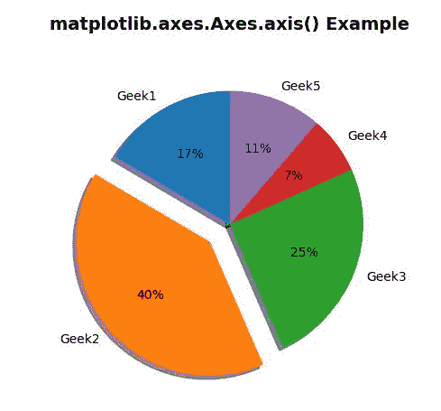

# Python 中的 Matplotlib.axes.Axes.axis()

> 原文:[https://www . geesforgeks . org/matplotlib-axes-axes-axes-in-axis-in-python/](https://www.geeksforgeeks.org/matplotlib-axes-axes-axis-in-python/)

**[Matplotlib](https://www.geeksforgeeks.org/python-introduction-matplotlib/)** 是 Python 中的一个库，是 NumPy 库的数值-数学扩展。**轴类**包含了大部分的图形元素:轴、刻度、线二维、文本、多边形等。，并设置坐标系。Axes 的实例通过回调属性支持回调。

## matplotlib.axes.Axes.axis()函数

matplotlib 库的 Axes 模块中的 **Axes.axis()函数**是获取或设置一些轴属性的便捷方法。

> **语法:** Axes.axis(self，*args，**kwargs)
> 
> **参数:**该方法接受以下描述的参数:
> 
> *   **xmin、xmax、ymin、ymax :** 这些参数是要设置的轴限制。
>     
>     ```py
>     axis([xmin, xmax, ymin, ymax])
>     ```
>     
>     
> *   **选项:**该参数是用于打开或关闭轴线和标签的选项。
> *   **发射:**此参数用于检查是否通知观察者轴极限变化。
> 
> **返回:**该方法返回以下内容:
> 
> *   **xmin，xmax，ymin，ymax :** 这将返回轴限制。

下面的例子说明了 matplotlib.axes.Axes.axis()函数在 matplotlib.axes 中的作用:

**例 1:**

```py
# Implementation of matplotlib function
import matplotlib.pyplot as plt
import numpy as np

labels = 'Geek1', 'Geek2', 'Geek3', 'Geek4', 'Geek5'
sizes = [95, 230, 145, 40, 65]
explode = (0, 0.2, 0, 0, 0)

fig1, ax1 = plt.subplots()
ax1.pie(sizes, explode = explode, labels = labels,
        autopct ='% 1.0f %%',
        shadow = True, startangle = 90)
ax1.axis('square')
ax1.set_title('matplotlib.axes.Axes.axis() \
Example\n', fontsize = 14, fontweight ='bold')
plt.show()
```

**输出:**


**例 2:**

```py
# Implementation of matplotlib function
import matplotlib.pyplot as plt
import matplotlib.patches as patches
import matplotlib.cbook as cbook

# image used is 
# https://media.geeksforgeeks.org / wp-content 
# / uploads / 20200402214740 / geek.jpg
with cbook.get_sample_data('geek.JPG') as image_file:
    image = plt.imread(image_file)

fig, (ax, ax1) = plt.subplots(2, 1)
im = ax.imshow(image)
patch = patches.Rectangle((0, 0), 260, 200, 
                          transform = ax.transData)
im.set_clip_path(patch)
ax.set_title('Without Axis Function',
             fontsize = 10, fontweight ='bold')

im = ax1.imshow(image)
patch = patches.Rectangle((0, 0), 260, 200,
                          transform = ax1.transData)
im.set_clip_path(patch)
ax1.axis('off')

ax1.set_title("Axis Function with 'Off' option",
              fontsize = 10, fontweight ='bold')
plt.show()
```

**输出:**
