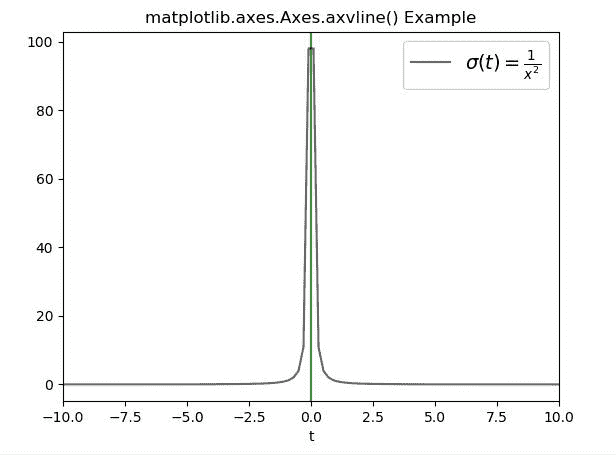

# matplotlib . axes . axvline()在 Python 中

> 哎哎哎:# t0]https://www . geeksforgeeks . org/matplotlib-axes-axvline-in-python/

**[Matplotlib](https://www.geeksforgeeks.org/python-introduction-matplotlib/)** 是 Python 中的一个库，是 NumPy 库的数值-数学扩展。**轴类**包含了大部分的图形元素:轴、刻度、线二维、文本、多边形等。，并设置坐标系。Axes 的实例通过回调属性支持回调。

## matplotlib.axes.Axes.axvline()函数

matplotlib 库的 Axes 模块中的 **Axes.axvline()函数**用于添加一条穿过轴的垂直线。

> **语法:** Axes.axvline(self，x=0，ymin=0，ymax=1，**kwargs)
> 
> **参数:**该方法接受以下描述的参数:
> 
> *   **x:** 此参数为垂直线在数据坐标中的 x 位置，默认值为 0。
> *   **ymin:** 这个参数应该在 0 到 1 之间，0 是图的底部，1 是图的顶部。其默认值为 0。
> *   **ymax:** 这个参数应该在 0 到 1 之间，0 是图的底部，1 是图的顶部。其默认值为 1。
> 
> **返回:**这将返回以下内容:
> 
> *   **线:**这将返回表示打印数据的线 2D 对象列表。

下面的例子说明了 matplotlib.axes.Axes.axhline()函数在 matplotlib.axes 中的作用:

**例 1:**

```
# Implementation of matplotlib function
import matplotlib.pyplot as plt
import numpy as np
import matplotlib.collections as collections

t = np.arange(0.0, 5, 0.01)
s1 = np.sin(4 * np.pi * t)

fig, ax = plt.subplots()

ax.plot(t, s1, color ='black', alpha = 0.75, lw = 1)
ax.axvline(3, color ='green', lw = 2, alpha = 0.75)
ax.set_title('matplotlib.axes.Axes.axvline() Example')
plt.show()
```

**输出:**


**例 2:**

```
# Implementation of matplotlib function
import matplotlib.pyplot as plt
import numpy as np

t = np.linspace(-10, 10, 100)
sig = 1 / t**2
fig, ax = plt.subplots()

plt.axvline(color ="green", alpha = 0.8, lw = 1.5)
plt.plot(t, sig, linewidth = 1.5, color ="black",
         alpha = 0.6,
         label = r"$\sigma(t) = \frac{1}{x ^ 2}{content}quot;)

plt.xlim(-10, 10)
plt.xlabel("t")
plt.legend(fontsize = 14)

ax.set_title('matplotlib.axes.Axes.axvline() Example')
plt.show()
```

**输出:**
