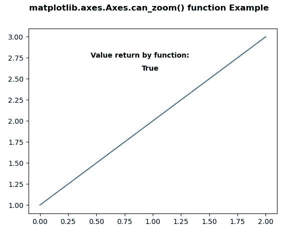
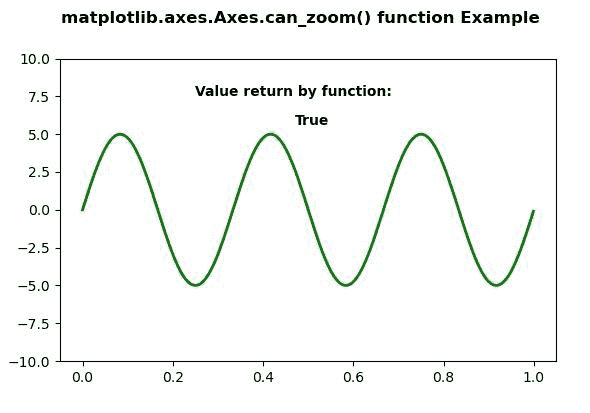

# matplotlib . axes . can _ zoom()用 Python

表示

> 原文:[https://www . geesforgeks . org/matplotlib-axes-axes-can _ zoom-in-python/](https://www.geeksforgeeks.org/matplotlib-axes-axes-can_zoom-in-python/)

**[Matplotlib](https://www.geeksforgeeks.org/python-introduction-matplotlib/)** 是 Python 中的一个库，是 NumPy 库的数值-数学扩展。**轴类**包含了大部分的图形元素:轴、刻度、线二维、文本、多边形等。，并设置坐标系。Axes 的实例通过回调属性支持回调。

## matplotlib.axes.Axes.can_zoom()函数

matplotlib 库的 Axes 模块中的 **Axes.can_zoom()函数**用于检查轴是否支持任何缩放框按钮功能。

> **语法:** Axes.can_zoom(自)
> 
> **参数:**此方法不接受任何参数。
> 
> **返回值:**如果支持任何缩放框按钮功能，该方法返回布尔值 True。

以下示例说明 matplotlib.axes.Axes.can_zoom()函数在 matplotlib.axes:
**示例 1:**

```
# Implementation of matplotlib function
import matplotlib.pyplot as plt
import numpy as np

fig, ax = plt.subplots()
ax.plot([1, 2, 3])

w = ax.can_zoom()

ax.text(0.45, 2.75, "Value return by function:",
        fontweight ="bold")
ax.text(0.9, 2.6, w, fontweight ="bold")

fig.suptitle('matplotlib.axes.Axes.can_zoom() function \
Example\n\n', fontweight ="bold")

plt.show()
```

**输出:**


**例 2:**

```
# Implementation of matplotlib function
import numpy as np
import matplotlib.pyplot as plt
from matplotlib.widgets import Slider, Button, RadioButtons

fig, ax1 = plt.subplots()
plt.subplots_adjust(bottom = 0.25)
t = np.arange(0.0, 1.0, 0.001)
a0 = 5
f0 = 3
delta_f = 5.0
s = a0 * np.sin(2 * np.pi * f0 * t)

ax1.plot(t, s, lw = 2, color = 'green')
ax1.set_ymargin(0.5)

w = ax1.can_zoom()

ax1.text(0.25, 7.5, "Value return by function:",
         fontweight ="bold")
ax1.text(0.47, 5.6, w, fontweight ="bold")

fig.suptitle('matplotlib.axes.Axes.can_zoom() function \
Example\n\n', fontweight ="bold")

plt.show()
```

**输出:**
