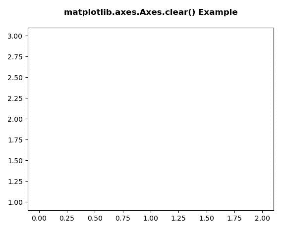

# Python 中的 Matplotlib.axes.Axes.clear()

> 原文:[https://www . geeksforgeeks . org/matplotlib-axes-axes-clear-in-python/](https://www.geeksforgeeks.org/matplotlib-axes-axes-clear-in-python/)

**[Matplotlib](https://www.geeksforgeeks.org/python-introduction-matplotlib/)** 是 Python 中的一个库，是 NumPy 库的数值-数学扩展。**轴类**包含了大部分的图形元素:轴、刻度、线二维、文本、多边形等。，并设置坐标系。Axes 的实例通过回调属性支持回调。

## matplotlib.axes.Axes.clear()函数

matplotlib 库的 Axes 模块中的 **Axes.clear()函数**用于清除轴。

> **语法:** Axes.clear(自我)
> 
> **参数:**此方法不接受任何参数。
> 
> **返回:**该方法不返回任何值。

下面的例子说明了 matplotlib.axes.Axes.clear()函数在 matplotlib.axes 中的作用:

**例 1:**

```py
# Implementation of matplotlib function
import numpy as np
import matplotlib.pyplot as plt

fig, ax = plt.subplots()
ax.set_xlabel('x-axis')
ax.set_ylabel('y-axis')
ax.plot([1, 2, 3])
ax.grid(True)
ax.clear()
ax.set_title('matplotlib.axes.Axes.clear() \
Example\n', fontsize = 12, fontweight ='bold')
plt.show()
```

**输出:**


**例 2:**

```py
# Implementation of matplotlib function
import numpy as np
import matplotlib.pyplot as plt

t = np.linspace(0.0, 2.0, 201)
s = np.sin(2 * np.pi * t)

fig, [ax, ax1] = plt.subplots(2, 1, sharex = True)

ax.set_ylabel('y-axis')
ax.plot(t, s)
ax.grid(True)
ax.set_title('matplotlib.axes.Axes.clear() Example\n\n Sample Example',
             fontsize = 12, fontweight ='bold')

ax1.set_ylabel('y-axis')
ax1.plot(t, s)
ax1.grid(True)
ax1.clear()
ax1.set_title('Above example with clear() \
function', fontsize = 12, fontweight ='bold')
plt.show()
```

**输出:**
