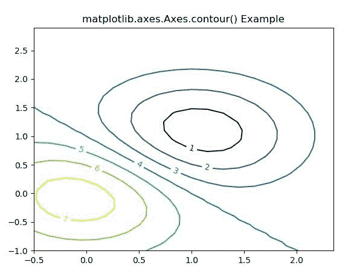

# matplot lib . axes . axes . contour()用 Python

表示

> 哎哎哎:# t0]https://www . geeksforgeeks . org/matplotlib-axes-axes-contour-in-python/

**[Matplotlib](https://www.geeksforgeeks.org/python-introduction-matplotlib/)** 是 Python 中的一个库，是 NumPy 库的数值-数学扩展。**轴类**包含了大部分的图形元素:轴、刻度、线二维、文本、多边形等。，并设置坐标系。Axes 的实例通过回调属性支持回调。

## matplotlib.axes.Axes.contour()函数

matplotlib 库中的 **Axes.contour()函数**用于绘制等高线。**等高线**画等高线。

> **语法:**
> 
> ```py
> Axes.contour(self, *args, data=None, **kwargs)
> contour([X, Y, ] Z, [levels], **kwargs)
> ```
> 
> **参数:**该方法接受以下描述的参数:
> 
> *   **X，Y:** 这些参数是 z 中数值的坐标
> *   **Z :** 该参数是绘制轮廓的高度值。
> *   **级别:**此参数用于确定轮廓线/区域的数量和位置。
> 
> **返回:**这将返回以下内容:
> 
> *   **c :** 这将返回**四通道**。

下面的例子说明了 matplotlib.axes.Axes.contour()函数在 matplotlib.axes 中的作用:

**示例-1:**

```py
# Implementation of matplotlib function
import numpy as np
import matplotlib.pyplot as plt
import matplotlib.ticker as ticker
import matplotlib

delta = 0.15
x = np.arange(-0.5, 2.5, delta)
y = np.arange(-1.0, 3.0, delta)
X, Y = np.meshgrid(x, y)
Z = (np.exp(-X**2 - Y**2) - np.exp(-(X - 1)**2 - (Y - 1)**2))

fig1, ax1 = plt.subplots()
CS1 = ax1.contour(X, Y, Z)

fmt = {}
strs = ['1', '2', '3', '4', '5', '6', '7']
for l, s in zip(CS1.levels, strs):
    fmt[l] = s
ax1.clabel(CS1, CS1.levels, inline = True,
           fmt = fmt, fontsize = 10)

ax1.set_title('matplotlib.axes.Axes.contour() Example')
plt.show()
```

**输出:**


**示例-2:**

```py
# Implementation of matplotlib function
import matplotlib
import numpy as np
import matplotlib.cm as cm
import matplotlib.pyplot as plt

delta = 0.25
x = np.arange(-5.0, 5.0, delta)
y = np.arange(-3.3, 5.5, delta)
X, Y = np.meshgrid(x, y)
Z = (np.exp(-X**2 - Y**2) - np.exp(-(X - 1)**2 - (Y - 1)**2)) * 3

fig, ax = plt.subplots()
im = ax.imshow(Z, interpolation ='bilinear', origin ='lower',
               cmap ="Greens", extent =(-3, 3, -2, 2))

levels = np.arange(-1.2, 1.6, 0.2)
CS = ax.contour(Z, levels, origin ='lower', cmap ='Blues',
                linewidths = 2, extent =(-3, 3, -2, 2))
zc = CS.collections[6]
plt.setp(zc, linewidth = 4)

ax.clabel(CS, levels, inline = 1, fmt ='% 1.1f',
          fontsize = 14)
ax.set_title('matplotlib.axes.Axes.contour() Example')
plt.show()
```

**输出:**
