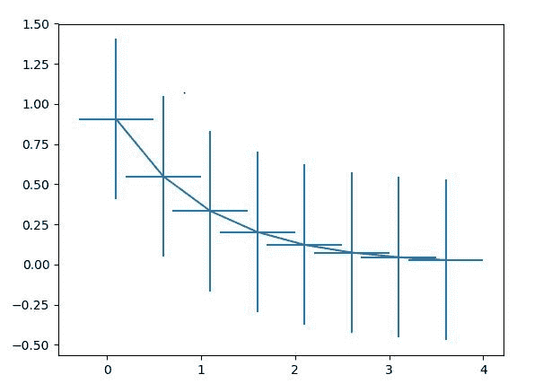
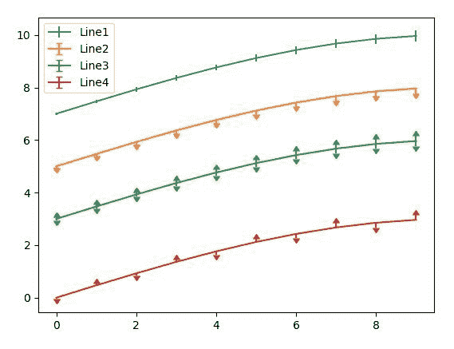

# matplotlib . axes . errorbar()在 Python

中

> 哎哎哎:# t0]https://www . geeksforgeeks . org/matplot lib-axes-errorbar-in-python/

**[Matplotlib](https://www.geeksforgeeks.org/python-introduction-matplotlib/)** 是 Python 中的一个库，是 NumPy 库的数值-数学扩展。**轴类**包含了大部分的图形元素:轴、刻度、线二维、文本、多边形等。，并设置坐标系。Axes 的实例通过回调属性支持回调。

**示例:**

```py
# Implementation of matplotlib function

import matplotlib.pyplot as plt
import numpy as np

# make an agg figure
fig, ax = plt.subplots()

ax.plot([1, 2, 3])
ax.set_title('matplotlib.axes.Axes.plot() example 1')
fig.canvas.draw()

plt.show()
```

**输出:**


## matplotlib . axes . axes . errorbar()函数

matplotlib 库的 Axes 模块中的 **Axes.errorbar()函数**用于将 y 对 x 绘制为带有附加误差线的线条和/或标记。

> **语法:** Axes.errorbar(self，x，y，yerr=None，xerr=None，fmt= "，ecolor=None，elinewidth = None，over = None，barsabove = False，lolims=False，uplims=False，xlolims=False，xuplims=False，errorevery=1，capthick=None，*，data=None，* * * kwargs)

**参数:**该方法接受以下描述的参数:

*   **x，y:** 这些参数是数据点的水平和垂直坐标。
*   **fmt:** 该参数为可选参数，包含字符串值。
*   **xerr，yerr:** 这些参数包含一个数组。并且错误数组应该有正值。
*   **ecolor:** 该参数为可选参数。它是误差线的颜色，默认值为*无*。
*   **elinewidth:** 该参数也是可选参数。默认值为误差线的线宽*无*。
*   **倾覆:**该参数也是可选参数。它是以点为单位的误差线长度，默认值为*无*。
*   **barsabove:** 该参数也是可选参数。它包含布尔值“真”，用于在绘图符号上方绘制误差线。其默认值为“假”。
*   **lolims、uplims、xlolims、xuplims:** 这些参数也是可选参数。它们包含布尔值，用于指示一个值只给出上限/下限。
*   **错误每:**该参数也是可选参数。它们包含用于在数据子集上绘制误差线的整数值。

**返回:**返回容器，包括以下内容:

*   **绘图线:**这将返回 x，y 绘图标记和/或线的线 2D 实例。
*   **caplines:** 这将返回误差线 caps 的 Line2D 实例的元组。
*   **barlinecols:** 这将返回 LineCollection 的元组，包含水平和垂直误差范围。

下面的例子说明了 matplotlib.axes.Axes.errorbar()函数在 matplotlib.axes 中的作用:

**示例#1:**

```py
# Implementation of matplotlib function

import numpy as np
import matplotlib.pyplot as plt

# example data
xval = np.arange(0.1, 4, 0.5)
yval = np.exp(-xval)

fig, ax = plt.subplots()
ax.errorbar(xval, yval, xerr = 0.4, yerr = 0.5)
plt.show()
```

**输出:**


**例 2:**

```py
# Implementation of matplotlib function

import numpy as np
import matplotlib.pyplot as plt

fig = plt.figure()
x = np.arange(10)
y = 3 * np.sin(x / 20 * np.pi)
yerr = np.linspace(0.05, 0.2, 10)

plt.errorbar(x, y + 7, yerr = yerr, 
             label ='Line1')

plt.errorbar(x, y + 5, yerr = yerr,
             uplims = True, label ='Line2')

plt.errorbar(x, y + 3, yerr = yerr, 
             uplims = True, lolims = True,
             label ='Line3')

upperlimits = [True, False] * 5
lowerlimits = [False, True] * 5

plt.errorbar(x, y, yerr = yerr, 
             uplims = upperlimits, 
             lolims = lowerlimits,
             label ='Line4')

plt.legend(loc ='upper left')
plt.show()
```

**输出:**
