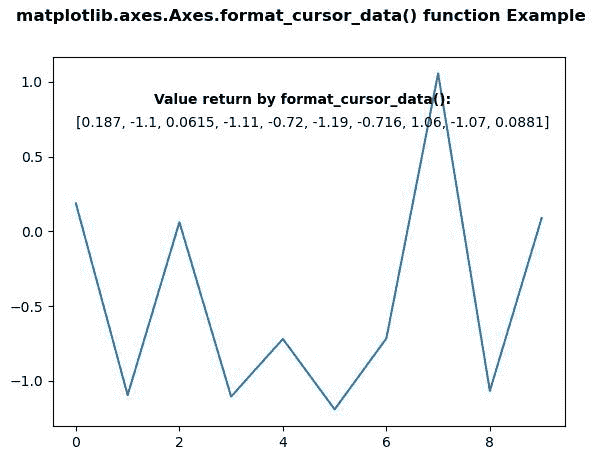
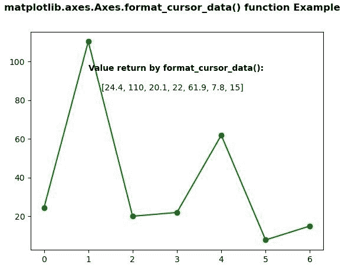

# Python 中的 matplotlib . axes . axes . format _ cursor _ data()

> 原文:[https://www . geeksforgeeks . org/matplotlib-axes-axes-format _ cursor _ data-in-python/](https://www.geeksforgeeks.org/matplotlib-axes-axes-format_cursor_data-in-python/)

**[Matplotlib](https://www.geeksforgeeks.org/python-introduction-matplotlib/)** 是 Python 中的一个库，是 NumPy 库的数值-数学扩展。**轴类**包含了大部分的图形元素:轴、刻度、线二维、文本、多边形等。，并设置坐标系。Axes 的实例通过回调属性支持回调。

## matplotlib . axes . axes . format _ cursor _ data()函数

matplotlib 库的 Axes 模块中的 **Axes.format_cursor_data()函数**用于返回数据的字符串表示。

> **语法:** Axes.format_cursor_data(自身，数据)
> 
> **参数:**该方法接受以下参数，如下所述:
> 
> *   **数据:**该参数是曾经使用过的数据。
> 
> **返回:**该方法返回数据的字符串表示形式。

下面的例子说明了 matplotlib.axes . axes . format _ cursor _ data()函数在 matplotlib . axes 中的作用:

**例 1:**

```
# Implementation of matplotlib function
import numpy as np
import matplotlib.pyplot as plt

np.random.seed(10**7)
geeksx = np.random.randn(10)

fig, ax = plt.subplots()
ax.plot(geeksx)

ax.text(1.5, 0.85, "Value return by format_cursor_data():",
        fontweight ="bold") 

ax.text(0, 0.7, ax.format_cursor_data(geeksx))

fig.suptitle('matplotlib.axes.Axes.format_cursor_data() \
function Example', fontweight ="bold")

plt.show()
```

**输出:**


**例 2:**

```
# Implementation of matplotlib function
import numpy as np
import matplotlib.pyplot as plt

geeksx = np.array([24.40, 110.25, 20.05,
                   22.00, 61.90, 7.80, 
                   15.00])

fig, ax = plt.subplots()
ax.plot(geeksx, 'go-')

ax.text(1, 95, "Value return by format_cursor_data():",
        fontweight ="bold") 

ax.text(1.3, 85, ax.format_cursor_data(geeksx))

fig.suptitle('matplotlib.axes.Axes.format_cursor_data()\
function Example', fontweight ="bold")

plt.show()
```

**输出:**
