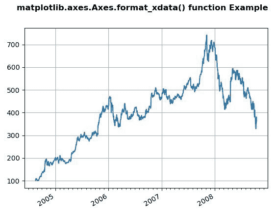

# matplotlib . axes . format _ xddata()用 Python

表示

> 哎哎哎:# t0]https://www . geeksforgeeks . org/matplotlib-axes-axes-format _ xdata-in-python/

**[Matplotlib](https://www.geeksforgeeks.org/python-introduction-matplotlib/)** 是 Python 中的一个库，是 NumPy 库的数值-数学扩展。**轴类**包含了大部分的图形元素:轴、刻度、线二维、文本、多边形等。，并设置坐标系。Axes 的实例通过回调属性支持回调。

## matplot lib . axes . axes . format _ xddata()函数

matplotlib 库的 Axes 模块中的 **Axes.format_xdata()函数**用于返回 x 格式的 x 值。

**语法:**

```
Axes.format_xdata(self, x)

```

下面的例子说明了 matplotlib.axes . axes . format _ xdata()函数在 matplotlib . axes 中的作用:

**例 1:**

```
# Implementation of matplotlib function
import numpy as np
import matplotlib.pyplot as plt
import matplotlib.dates as mdates
import matplotlib.cbook as cbook

years = mdates.YearLocator()   
months = mdates.MonthLocator()  
years_fmt = mdates.DateFormatter('% Y')

with cbook.get_sample_data('goog.npz') as datafile:
    data = np.load(datafile)['price_data'].view(np.recarray)

fig, ax = plt.subplots()
ax.plot('date', 'adj_close', data = data, color ="green")

ax.xaxis.set_major_locator(years)
ax.set_ylim((100, 300))

ax.format_xdata = mdates.DateFormatter('% m')
ax.grid(True)

fig.suptitle('matplotlib.axes.Axes.format_xdata() function\
 Example', fontweight ="bold")
plt.show()
```

**输出:**


**例 2:**

```
# Implementation of matplotlib function
import numpy as np
import matplotlib.pyplot as plt
import matplotlib.dates as mdates
import matplotlib.cbook as cbook

years = mdates.YearLocator()   
months = mdates.MonthLocator()  
years_fmt = mdates.DateFormatter('% Y')

with cbook.get_sample_data('goog.npz') as datafile:
    data = np.load(datafile)['price_data']

fig, ax = plt.subplots()
ax.plot('date', 'adj_close', data = data)

ax.xaxis.set_major_locator(years)
ax.xaxis.set_major_formatter(years_fmt)
ax.xaxis.set_minor_locator(months)

ax.format_xdata = mdates.DateFormatter('% Y')
ax.grid(True)

fig.autofmt_xdate()

fig.suptitle('matplotlib.axes.Axes.format_xdata() function \
Example', fontweight ="bold")
plt.show()
```

**输出:**
