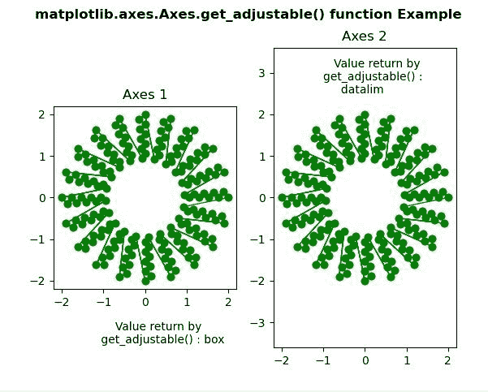

# Python 中的 matplotlib . axes . axes . get _ 可调()

> 原文:[https://www . geesforgeks . org/matplotlib-axes-axes-get _ 可调-in-python/](https://www.geeksforgeeks.org/matplotlib-axes-axes-get_adjustable-in-python/)

**[Matplotlib](https://www.geeksforgeeks.org/python-introduction-matplotlib/)** 是 Python 中的一个库，是 NumPy 库的数值-数学扩展。**轴类**包含了大部分的图形元素:轴、刻度、线二维、文本、多边形等。，并设置坐标系。Axes 的实例通过回调属性支持回调。

## matplotlib . axes . axes . get _ 可调()函数

matplotlib 库的 axes 模块中的**Axes . get _ 可调()函数**用于获取 Axes 给定的哪个参数来实现给定的方面。

> **语法:**axes . get _ 可调(自)
> 
> **参数:**该方法不接受任何参数。
> 
> **返回值:**此方法返回**可调**值。

以下示例说明了 matplotlib.axes . axes . get _ 可调()函数在 matplotlib . axes 中的作用:

**例 1:**

```
# ImpleIn Reviewtation of matplotlib function  
import matplotlib.pyplot as plt

fig, (ax1, ax2) = plt.subplots(1, 2)
ax1.set_xscale("log")
ax1.set_yscale("log")
ax1.set_xlim(1e1, 1e3)
ax1.set_ylim(1e2, 1e3)
ax1.set_aspect(1)
ax1.set_title("Axes 1")

ax2.set_xscale("log")
ax2.set_yscale("log")
ax2.set_adjustable("datalim")
ax2.plot([1, 113, 10], [1, 119, 100], "o-")
ax2.set_xlim(1e-1, 1e2)
ax2.set_ylim(1e-1, 1e3)
ax2.set_aspect(1)
ax2.set_title("Axes 2")

w = ax1.get_adjustable()
w1 = ax2.get_adjustable()

ax1.text(20, 400,
         "     Value return by\n get_adjustable() : " +str(w))
ax2.text(1, 200, 
         "   Value return by \nget_adjustable() : \n     " +str(w1))

fig.suptitle('matplotlib.axes.Axes.get_adjustable() function Example\n',
             fontweight ="bold")
fig.canvas.draw()
plt.show()
```

**输出:**


**例 2:**

```
# ImpleIn Reviewtation of matplotlib function  
import matplotlib.pyplot as plt
import matplotlib.tri as tri
import numpy as np

n_angles = 40
n_radii = 10
min_radius = 2
radii = np.linspace(min_radius, 0.95, n_radii)

angles = np.linspace(0, 4 * np.pi, n_angles,
                     endpoint = False)
angles = np.repeat(angles[..., np.newaxis], 
                   n_radii, axis = 1)

angles[:, 1::2] += np.pi / n_angles

x = (radii * np.cos(angles)).flatten()
y = (radii * np.sin(angles)).flatten()

triang = tri.Triangulation(x, y)

triang.set_mask(np.hypot(x[triang.triangles].mean(axis = 1),
                         y[triang.triangles].mean(axis = 1))
                < min_radius)
fig, (ax, ax1) = plt.subplots(1, 2)

ax.triplot(triang, 'bo-', lw = 1, color = "green")
ax.set_aspect('equal')
ax.set_title("Axes 1")

ax1.set_aspect('equal')
ax1.set_adjustable("datalim")
ax1.triplot(triang, 'bo-', lw = 1, color = "green")
ax1.set_title("Axes 2")

w = ax.get_adjustable()
w1 = ax1.get_adjustable()

ax.text(-1.15, -3.5,
        "     Value return by\n get_adjustable() : " +str(w))

ax1.text(-1, 2.5, 
         "   Value return by \nget_adjustable() : \n     " +str(w1))

fig.suptitle('matplotlib.axes.Axes.get_adjustable() function \
Example\n', fontweight ="bold")
fig.canvas.draw()
plt.show()
```

**输出:**
