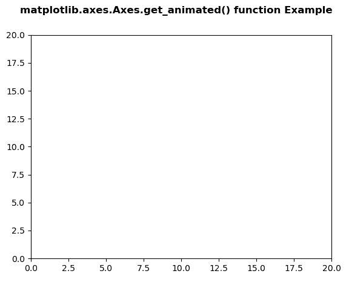
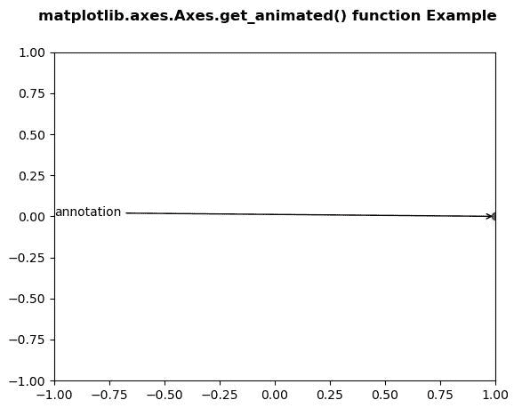

# Python 中的 matplotlib . axes . axes . get _ animated()

> 原文:[https://www . geeksforgeeks . org/matplotlib-axes-axes-get _ animated-in-python/](https://www.geeksforgeeks.org/matplotlib-axes-axes-get_animated-in-python/)

**[Matplotlib](https://www.geeksforgeeks.org/python-introduction-matplotlib/)** 是 Python 中的一个库，是 NumPy 库的数值-数学扩展。**轴类**包含了大部分的图形元素:轴、刻度、线二维、文本、多边形等。，并设置坐标系。Axes 的实例通过回调属性支持回调。

## matplotlib . axes . axes . get _ animated()函数

matplotlib 库的 Axes 模块中的 **Axes.get_animated()函数**用于获取动画状态。

> **语法:** Axes.get_animated(self)
> 
> **参数:**该方法不接受任何参数。
> 
> **返回:**该方法返回动画状态。

下面的例子说明了 matplotlib.axes . axes . get _ animated()函数在 matplotlib . axes 中的作用:

**例 1:**

```py
# Implementation of matplotlib function
import numpy as np
import matplotlib.pyplot as plt
import matplotlib.animation as animation

data = np.array([[1, 2, 3, 4, 5], 
                [7, 4, 9, 2, 3]])

fig = plt.figure()
ax = plt.axes(xlim =(0, 20), ylim =(0, 20))

line, = ax.plot([], [], 'r-')
annotation = ax.annotate('', xy =(data[0][0], 
                         data[1][0]))
annotation.set_animated(True)
w = annotation.get_animated()

print(str(w))

fig.suptitle('matplotlib.axes.Axes.get_animated() \
function Example\n\n', fontweight ="bold")

plt.show()
```

**输出:**



```py
True

```

**例 2:**

```py
# Implementation of matplotlib function
import numpy as np
import matplotlib.pyplot as plt
import matplotlib.animation as animation

fig, ax = plt.subplots()

ax.set_xlim([-1, 1])
ax.set_ylim([-1, 1])

L = 50
theta = np.linspace(0, 2 * np.pi, L)
r = np.ones_like(theta)

x = r * np.cos(theta)
y = r * np.sin(theta)

line, = ax.plot(1, 0, 'ro')

annotation = ax.annotate(
    'annotation', xy =(1, 0), xytext =(-1, 0),
    arrowprops = {'arrowstyle': "->"}
)
annotation.set_animated(False)

w = annotation.get_animated()

print(str(w))

fig.suptitle('matplotlib.axes.Axes.get_animated()\
 function Example\n\n', fontweight ="bold")

plt.show()
```

**输出:**



```py
False

```