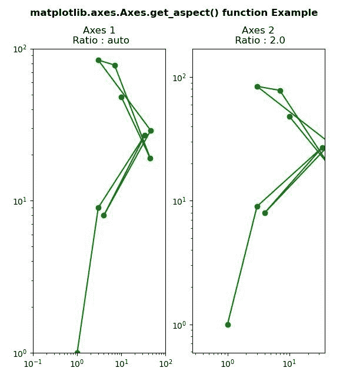
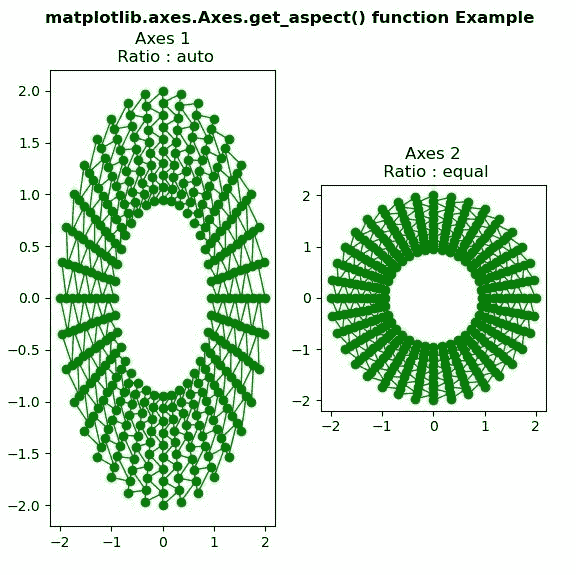

# matplotlib . axes . get _ aspect()用 Python

表示

> 哎哎哎:# t0]https://www . geeksforgeeks . org/matplot lib-axes-get _ aspect-in-python/

**[Matplotlib](https://www.geeksforgeeks.org/python-introduction-matplotlib/)** 是 Python 中的一个库，是 NumPy 库的数值-数学扩展。**轴类**包含了大部分的图形元素:轴、刻度、线二维、文本、多边形等。，并设置坐标系。Axes 的实例通过回调属性支持回调。

## matplotlib . axes . axes . get _ aspect()函数

matplotlib 库的 Axes 模块中的 **Axes.get_aspect()函数**用于获取轴缩放的纵横比，即 y 单位与 x 单位的比值

> **语法:** Axes.get_aspect(self)
> 
> **参数:**该方法不接受任何参数。
> 
> **返回值:**此方法返回**方面**值。

下面的例子说明了 matplotlib.axes . axes . get _ aspect()函数在 matplotlib . axes 中的作用:

**例 1:**

```
# ImpleIn Reviewtation of matplotlib function  
import matplotlib.pyplot as plt

fig, (ax1, ax2) = plt.subplots(1, 2)
ax1.set_xscale("log")
ax1.set_yscale("log")
ax1.set_adjustable("datalim")
ax1.plot([1, 3, 34, 4, 46, 3, 7, 45, 10],
         [1, 9, 27, 8, 29, 84, 78, 19, 48],
         "o-", color ="green")

ax1.set_xlim(1e-1, 1e2)
ax1.set_ylim(1, 1e2)

ax2.set_xscale("log")
ax2.set_yscale("log")
ax2.set_adjustable("datalim")
ax2.plot([1, 3, 34, 4, 46, 3, 7, 45, 10],
         [1, 9, 27, 8, 29, 84, 78, 19, 48],
         "o-", color ="green")

ax2.set_xlim(1e-1, 1e2)
ax2.set_ylim(1, 1e2)
ax2.set_aspect(2)

w = ax1.get_aspect()
w1 = ax2.get_aspect()

ax1.set_title("Axes 1\n Ratio : " +str(w))
ax2.set_title("Axes 2\n Ratio : " +str(w1))

fig.suptitle('matplotlib.axes.Axes.get_aspect() \
function Example\n\n', fontweight ="bold")
fig.canvas.draw()
plt.show()
```

**输出:**


**例 2:**

```
# ImpleIn Reviewtation of matplotlib function  
import matplotlib.pyplot as plt
import matplotlib.tri as tri
import numpy as np

n_angles = 36
n_radii = 10
min_radius = 2
radii = np.linspace(min_radius, 0.95, n_radii)

angles = np.linspace(0, 2 * np.pi, n_angles, 
                     endpoint = False)

angles = np.repeat(angles[..., np.newaxis],
                   n_radii, axis = 1)

angles[:, 1::2] += 2 * np.pi / n_angles

x = (radii * np.cos(angles)).flatten()
y = (radii * np.sin(angles)).flatten()

triang = tri.Triangulation(x, y)

triang.set_mask(np.hypot(x[triang.triangles].mean(axis = 1),
                         y[triang.triangles].mean(axis = 1))
                < min_radius)
fig, (ax, ax1) = plt.subplots(1, 2)

ax.triplot(triang, 'bo-', lw = 1, color = "green")

ax1.set_aspect('equal')
ax1.triplot(triang, 'bo-', lw = 1, color = "green")

w = ax.get_aspect()
w1 = ax1.get_aspect()

ax.set_title("Axes 1\n Ratio : " +str(w))
ax1.set_title("Axes 2\n Ratio : " +str(w1))

fig.suptitle('matplotlib.axes.Axes.get_aspect() \
function Example\n\n', fontweight ="bold")
fig.canvas.draw()
plt.show()
```

**输出:**
