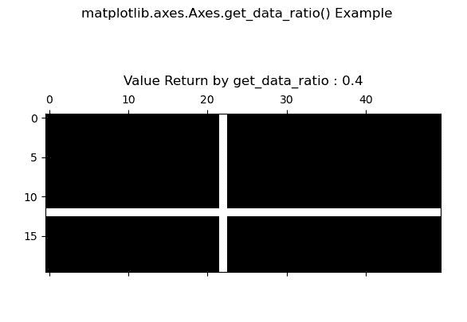

# Python 中的 matplotlib . axes . axes . get _ data _ ratio()

> 原文:[https://www . geeksforgeeks . org/matplotlib-axes-axes-get _ data _ ratio-in-python/](https://www.geeksforgeeks.org/matplotlib-axes-axes-get_data_ratio-in-python/)

**[Matplotlib](https://www.geeksforgeeks.org/python-introduction-matplotlib/)** 是 Python 中的一个库，是 NumPy 库的数值-数学扩展。**轴类**包含了大部分的图形元素:轴、刻度、线二维、文本、多边形等。，并设置坐标系。Axes 的实例通过回调属性支持回调。

## matplotlib . axes . axes . get _ data _ ratio()函数

matplotlib 库的 Axes 模块中的 **Axes.get_data_ratio()函数**用于获取原始数据的纵横比。

> **语法:** Axes.get_data_ratio(self)
> 
> **参数:**该方法不接受任何参数。
> 
> **返回:**该方法返回原始数据的长宽比。

下面的例子说明了 matplotlib.axes . axes . get _ data _ ratio()函数在 matplotlib . axes 中的作用:

**例 1:**

```
# Implementation of matplotlib function
import matplotlib.pyplot as plt
import numpy as np

fig, ax1 = plt.subplots()

x = np.random.randn(20, 50)
x[12, :] = 0.
x[:, 22] = 0.

ax1.spy(x)
ax1.set_title("Value Return by get_data_ratio : "
              +str(ax1.get_data_ratio())+"\n")

fig.suptitle('matplotlib.axes.Axes.get_data_ratio() \
Example')

plt.show()
```

**输出:**


**例 2:**

```
# Implementation of matplotlib function
import matplotlib.pyplot as plt
import numpy as np

fig, [(ax1, ax2), (ax3, ax4)] = plt.subplots(2, 2)

x = np.random.randn(20, 50)
x[5, :] = 0.
x[:, 12] = 0.

ax1.spy(x, markersize = 4)
ax2.spy(x, precision = 0.2, markersize = 4)

ax3.spy(x)
ax4.spy(x, precision = 0.4)

ax1.set_title("Value Return by get_data_ratio : "
              +str(ax1.get_data_ratio())+"\n")

ax2.set_title("Value Return by get_data_ratio : "
              +str(ax2.get_data_ratio())+"\n")

ax3.set_title("Value Return by get_data_ratio : "
              +str(ax3.get_data_ratio())+"\n")

ax4.set_title("Value Return by get_data_ratio : "
              +str(ax4.get_data_ratio())+"\n")

fig.suptitle('matplotlib.axes.Axes.get_data_ratio\
 Example')

plt.show()
```

**输出:**
