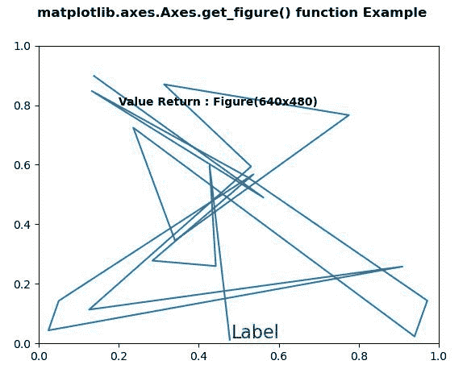
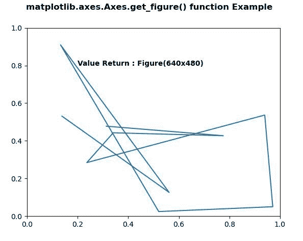

# Python 中的 matplotlib . axes . axes . get _ figure()

> 原文:[https://www . geeksforgeeks . org/matplotlib-axes-axes-get _ figure-in-python/](https://www.geeksforgeeks.org/matplotlib-axes-axes-get_figure-in-python/)

**[Matplotlib](https://www.geeksforgeeks.org/python-introduction-matplotlib/)** 是 Python 中的一个库，是 NumPy 库的数值-数学扩展。**轴类**包含了大部分的图形元素:轴、刻度、线二维、文本、多边形等。，并设置坐标系。Axes 的实例通过回调属性支持回调。

## matplotlib . axes . axes . get _ figure()函数

matplotlib 库的 Axes 模块中的 **Axes.get_figure()函数**用于获取艺术家所属的 figure 实例。

> **语法:** Axes.get_figure(self)
> 
> **参数:**该方法不接受任何参数。
> 
> **返回:**该方法返回艺术家所属的人物实例。

下面的例子说明了 matplotlib.axes . axes . get _ fig()函数在 matplotlib . axes 中的作用:

**例 1:**

```
# Implementation of matplotlib function
import numpy as np
import matplotlib.pyplot as plt
import matplotlib.lines as lines
import matplotlib.transforms as mtransforms
import matplotlib.text as mtext

class GFGfun(lines.Line2D):

    def __init__(self, *args, **kwargs):
        self.text = mtext.Text(0, 0, '')
        lines.Line2D.__init__(self, *args, **kwargs)
        self.text.set_text(self.get_label())

    def set_figure(self, figure):
        self.text.set_figure(figure)
        lines.Line2D.set_figure(self, figure)

    def set_axes(self, axes):
        self.text.set_axes(axes)
        lines.Line2D.set_axes(self, axes)

    def set_transform(self, transform):
        # 2 pixel offset
        texttrans = transform + mtransforms.Affine2D().translate(2, 2)
        self.text.set_transform(texttrans)
        lines.Line2D.set_transform(self, transform)

    def set_data(self, x, y):
        if len(x):
            self.text.set_position((x[-1], y[-1]))

        lines.Line2D.set_data(self, x, y)

    def draw(self, renderer):
        lines.Line2D.draw(self, renderer)
        self.text.draw(renderer)

np.random.seed(10**7)

fig, ax = plt.subplots()
x, y = np.random.rand(2, 20)
line = GFGfun(x, y, mfc ='green',
              ms = 12,
              label ='Label')

line.text.set_color('green')
line.text.set_fontsize(16)

ax.add_line(line)

ax.text(0.2, 0.8, "Value Return : "
        +str(ax.get_figure()), 
        fontweight ="bold")

fig.suptitle('matplotlib.axes.Axes.get_figure()\
 function Example\n\n', fontweight ="bold")

plt.show()
```

**输出:**


**例 2:**

```
# Implementation of matplotlib function
import numpy as np
import matplotlib.pyplot as plt
import matplotlib.lines as lines
import matplotlib.transforms as mtransforms
import matplotlib.text as mtext

class GFGfun(lines.Line2D):

    def __init__(self, *args, **kwargs):
        self.text = mtext.Text(0, 0, '')
        lines.Line2D.__init__(self, *args, **kwargs)
        self.text.set_text(self.get_label())

    def set_figure(self, figure):
        self.text.set_figure(figure)
        lines.Line2D.set_figure(self, figure)

np.random.seed(10**7)

fig, ax = plt.subplots()
x, y = np.random.rand(2, 10)
line = GFGfun(x, y,
              mfc ='green', ms = 12, label ='Label')

line.text.set_color('green')
line.text.set_fontsize(16)

ax.add_line(line)

ax.text(0.2, 0.8, "Value Return : "
        +str(ax.get_figure()),
        fontweight ="bold")

fig.suptitle('matplotlib.axes.Axes.get_figure()\
function Example\n\n', fontweight ="bold")

plt.show()
```

**输出:**
