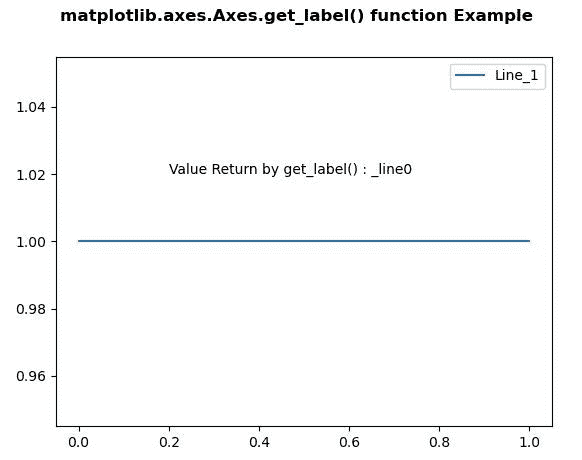
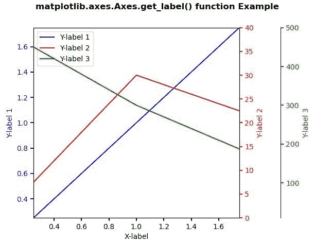

# matplotlib . axes . get _ label()用 Python

表示

> 原文:[https://www . geeksforgeeks . org/matplotlib-axes-axes-get _ label-in-python/](https://www.geeksforgeeks.org/matplotlib-axes-axes-get_label-in-python/)

**[Matplotlib](https://www.geeksforgeeks.org/python-introduction-matplotlib/)** 是 Python 中的一个库，是 NumPy 库的数值-数学扩展。**轴类**包含了大部分的图形元素:轴、刻度、线二维、文本、多边形等。，并设置坐标系。Axes 的实例通过回调属性支持回调。

## matplotlib.axes.Axes.get_label()函数

matplotlib 库中 Axes 模块中的 **Axes.get_label()函数**用于获取图例中该艺术家使用的标签。

> **语法:** Axes.get_label(self)
> 
> **参数:**该方法不接受任何参数。
> 
> **返回:**该方法返回图例中该艺术家使用的标签。

下面的例子说明了 matplotlib.axes.Axes.get_label()函数在 matplotlib.axes 中的作用:

**例 1:**

```py
# Implementation of matplotlib function
import matplotlib.pyplot as plt

fig, ax = plt.subplots()

x = [0, 1]
y = [1, 1]
line, = ax.plot(x, y)
ax.legend(("Line_1", ))

ax.text(0.2, 1.02, "Value Return by get_label()\
: " + str(line.get_label()))

fig.suptitle('matplotlib.axes.Axes.get_label() function\
Example\n\n', fontweight ="bold")

plt.show()
```

**输出:**


**例 2:**

```py
# Implementation of matplotlib function
import matplotlib.pyplot as plt

def make_patch_spines_invisible(ax):
    ax.set_frame_on(True)
    ax.patch.set_visible(False)
    for sp in ax.spines.values():
        sp.set_visible(False)

fig, host = plt.subplots()
fig.subplots_adjust(right = 0.75)

par1 = host.twinx()
par2 = host.twinx()

# Offset the right spine of par2.
# The ticks and label have already been
# placed on the right by twinx above.
par2.spines["right"].set_position(("axes", 1.2))

# Having been created by twinx, par2 has
# its frame off, so the line of its
# detached spine is invisible.  First,
# activate the frame but make the patch
# and spines invisible.
make_patch_spines_invisible(par2)

# Second, show the right spine.
par2.spines["right"].set_visible(True)

p1, = host.plot([0, 1, 2], [0, 1, 2],
                "b-", label ="Y-label 1")
p2, = par1.plot([0, 1, 2], [0, 30, 20],
                "r-", label ="Y-label 2")
p3, = par2.plot([0, 1, 2], [500, 300, 150], 
                "g-", label ="Y-label 3")

host.set_xlim(0.25, 1.75)
host.set_ylim(0.25, 1.75)
par1.set_ylim(0, 40)
par2.set_ylim(10, 500)

host.set_xlabel("X-label")
host.set_ylabel("Y-label 1")
par1.set_ylabel("Y-label 2")
par2.set_ylabel("Y-label 3")

host.yaxis.label.set_color(p1.get_color())
par1.yaxis.label.set_color(p2.get_color())
par2.yaxis.label.set_color(p3.get_color())

tkw = dict(size = 4, width = 1.5)
host.tick_params(axis ='y', 
                 colors = p1.get_color(), 
                 **tkw)
par1.tick_params(axis ='y', 
                 colors = p2.get_color(),
                 **tkw)
par2.tick_params(axis ='y',
                 colors = p3.get_color(),
                 **tkw)
host.tick_params(axis ='x',
                 **tkw)

lines = [p1, p2, p3]

host.legend(lines, [l.get_label() for l in lines])

fig.suptitle('matplotlib.axes.Axes.get_label()\
function Example\n\n', fontweight ="bold")

plt.show()
```

**输出:**
**图示:**
