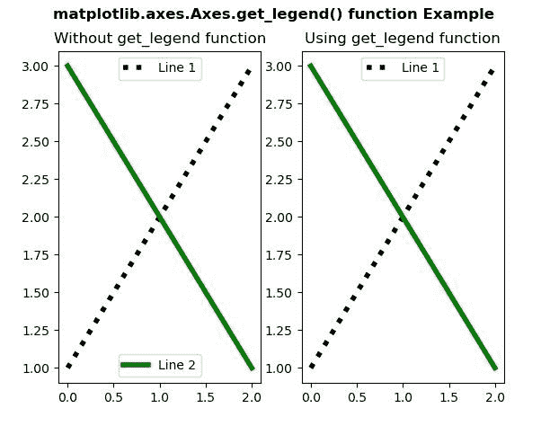

# Python 中的 matplotlib . axes . axes . get _ legend()

> 原文:[https://www . geeksforgeeks . org/matplotlib-axes-axes-get _ legend-in-python/](https://www.geeksforgeeks.org/matplotlib-axes-axes-get_legend-in-python/)

**[Matplotlib](https://www.geeksforgeeks.org/python-introduction-matplotlib/)** 是 Python 中的一个库，是 NumPy 库的数值-数学扩展。**轴类**包含了大部分的图形元素:轴、刻度、线二维、文本、多边形等。，并设置坐标系。Axes 的实例通过回调属性支持回调。

## matplotlib . axes . axes . get _ legend()函数

matplotlib 库的 Axes 模块中的 **Axes.get_legend()函数**用于返回 legend 实例，如果没有定义图例，则返回 None。

> **语法:** Axes.get_legend(self)
> 
> **参数:**该方法不接受任何参数。
> 
> **返回:**该函数返回图例实例，如果没有定义图例，则返回无。

下面的例子说明了 matplotlib.axes . axes . get _ legend()函数在 matplotlib . axes 中的作用:

**例 1:**

```
# Implementation of matplotlib function  
import matplotlib.pyplot as plt
import numpy as np

fig, ax = plt.subplots()
ax.plot([1, 6, 3, 8, 34, 13, 56, 67], color ="green")

x = ax.get_legend()
text ="Legend is present"
if x == None:
    text ="No legend present"

ax.text(2.5, 60, text, fontweight ="bold")
fig.suptitle('matplotlib.axes.Axes.get_legend() function\
 Example\n', fontweight ="bold")
fig.canvas.draw()
plt.show()
```

**输出:**


**例 2:**

```
# Implementation of matplotlib function
import matplotlib.pyplot as plt

fig, (ax, ax1) = plt.subplots(1, 2)
# axes1
line1, = ax.plot([1, 2, 3], label ="Line 1",
                 color ="black", linewidth = 4, 
                 linestyle =':')

line2, = ax.plot([3, 2, 1], label ="Line 2", 
                 color ="green",
                 linewidth = 4)

first_legend = ax.legend(handles =[line1], 
                         loc ='upper center')

ax.add_artist(first_legend)

ax.legend(handles =[line2], loc ='lower center')
ax.set_title("Without get_legend function")
# axes1
line1, = ax1.plot([1, 2, 3], label ="Line 1",
                  color ="black", linewidth = 4, 
                  linestyle =':')
line2, = ax1.plot([3, 2, 1], label ="Line 2",
                  color ="green",
                  linewidth = 4)

first_legend = ax1.legend(handles =[line1],
                          loc ='upper center')

ax1.add_artist(first_legend)

ax1.legend(handles =[line2], 
           loc ='lower center')
ax1.get_legend().set_visible(False)
ax1.set_title("Using get_legend function")
fig.suptitle('matplotlib.axes.Axes.get_legend()\
function Example\n', fontweight ="bold")

plt.show()
```

**输出:**
