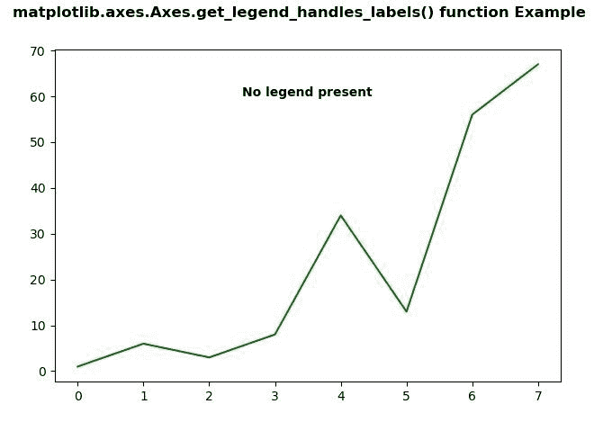
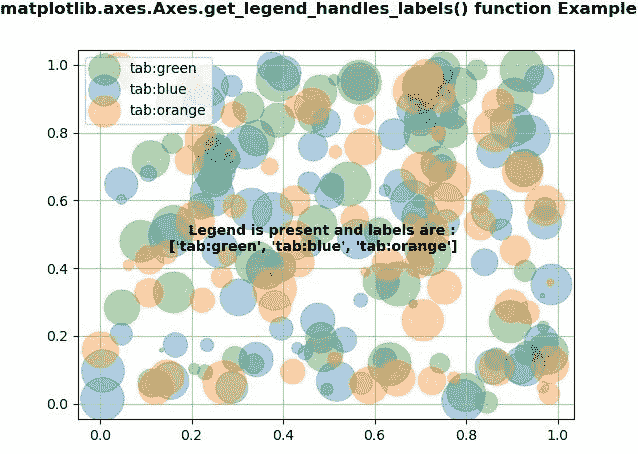

# Python 中的 matplotlib . axes . axes . get _ legend _ handles _ labels()

> 原文:[https://www . geeksforgeeks . org/matplotlib-axes-axes-get _ legend _ handles _ labels-in-python/](https://www.geeksforgeeks.org/matplotlib-axes-axes-get_legend_handles_labels-in-python/)

**[Matplotlib](https://www.geeksforgeeks.org/python-introduction-matplotlib/)** 是 Python 中的一个库，是 NumPy 库的数值-数学扩展。**轴类**包含了大部分的图形元素:轴、刻度、线二维、文本、多边形等。，并设置坐标系。Axes 的实例通过回调属性支持回调。

## matplotlib . axes . axes . get _ legend _ handles _ labels()函数

matplotlib 库的 Axes 模块中的**axes . get _ legend _ handles _ labels()函数**用于返回图例的句柄和标签。

> **语法:**axes . get _ legend _ handles _ labels(自身)
> 
> **参数:**该方法不接受任何参数。
> 
> **返回:**该功能返回图例的手柄和标签。

下面的例子说明了 matplotlib.axes . axes . get _ legend _ handles _ labels()函数在 matplotlib . axes 中的作用:

**例 1:**

```py
# Implementation of matplotlib function  
import matplotlib.pyplot as plt
import numpy as np

fig, ax = plt.subplots()
ax.plot([1, 6, 3, 8, 34, 13, 56, 67], color ="green")

h, l = ax.get_legend_handles_labels()
# print(h, l)
text ="Legend is present"
if h ==[]:
    text ="No legend present"
else:
    text+="and labels are : "+str(l)

ax.text(2.5, 60, text, fontweight ="bold")
fig.suptitle('matplotlib.axes.Axes.get_legend_handles_labels()\
 function Example\n', fontweight ="bold")
fig.canvas.draw()
plt.show()
```

**输出:**


**例 2:**

```py
# Implementation of matplotlib function
import numpy as np
np.random.seed(19680801)
import matplotlib.pyplot as plt

fig, ax = plt.subplots()
for color in [ 'tab:green', 'tab:blue', 'tab:orange']:
    n = 70
    x, y = np.random.rand(2, n)
    scale = 1000.0 * np.random.rand(n)
    ax.scatter(x, y, c = color, s = scale, label = color,
               alpha = 0.35)

ax.legend()
ax.grid(True)

h, l = ax.get_legend_handles_labels()
print(h, l)
text ="    Legend is present"
if h ==[]:
    text ="No legend present"
else:
    text+=" and labels are : \n"+str(l)

ax.text(0.15, 0.45, text, fontweight ="bold")
fig.suptitle('matplotlib.axes.Axes.get_legend_handles_labels()\
 function Example\n', fontweight ="bold")
fig.canvas.draw()
plt.show()
```

**输出:**
