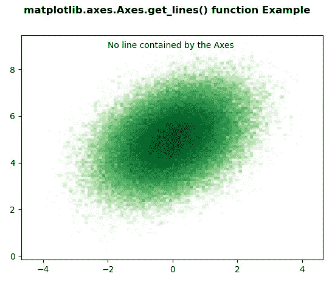
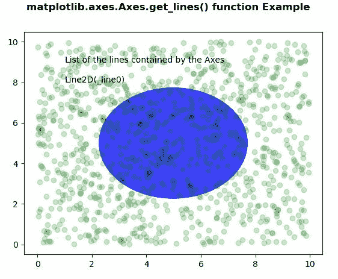

# Python 中的 Matplotlib.axes.Axes.get_lines()

> 原文:[https://www . geeksforgeeks . org/matplotlib-axes-axes-get _ line-in-python/](https://www.geeksforgeeks.org/matplotlib-axes-axes-get_lines-in-python/)

**[Matplotlib](https://www.geeksforgeeks.org/python-introduction-matplotlib/)** 是 Python 中的一个库，是 NumPy 库的数值-数学扩展。**轴类**包含了大部分的图形元素:轴、刻度、线二维、文本、多边形等。，并设置坐标系。Axes 的实例通过回调属性支持回调。

## matplotlib.axes.Axes.get_lines()函数

matplotlib 库的 axes 模块中的 **Axes.get_lines()函数**用于返回 Axes 包含的行列表

> **语法:**axes . get _ line(self)
> 
> **参数:**此方法不接受任何参数。
> 
> **返回:**该方法返回坐标轴包含的行列表。

下面的例子说明了 matplotlib.axes.Axes.get_lines()函数在 matplotlib.axes 中的作用:

**例 1:**

```py
# Implementation of matplotlib function
from matplotlib import colors
from matplotlib.ticker import PercentFormatter
import numpy as np
import matplotlib.pyplot as plt

N_points = 100000
x = np.random.randn(N_points)
y = .4 * x + np.random.randn(100000) + 5

fig, ax = plt.subplots()
ax.hist2d(x, y, bins = 100,
          norm = colors.LogNorm(), 
          cmap ="Greens")

w = list(ax.get_lines())
if len(w)== 0:
    ax.text(-2, 8.5, 
            "No line contained by the Axes \n")
else:
    ax.text(-3, 8.5,
            "List of the lines contained by the Axes \n")
    x = 8.5
    for i in w:

        ax.text(-3, x-0.5, str(i))
        x-= 0.5

fig.suptitle('matplotlib.axes.Axes.get_lines() \
function Example', fontweight ="bold")

plt.show()
```

**输出:**


**例 2:**

```py
# Implementation of matplotlib function
import numpy as np
import matplotlib.pyplot as plt
import matplotlib.patches as mpatches

fig, ax = plt.subplots()
x, y = 10 * np.random.rand(2, 1000)
ax.plot(x, y, 'go', alpha = 0.2)

circ = mpatches.Circle((0.5, 0.5),
                       0.25,
                       transform = ax.transAxes,
                       facecolor ='blue',
                       alpha = 0.75)

ax.add_patch(circ)

w = list(ax.get_lines())

if len(w)== 0:
    ax.text(1, 8.5,
            "No line contained by the Axes \n")

else:
    ax.text(1, 8.5,
            "List of the lines contained by the Axes \n")
    x = 8.5

    for i in w:
        ax.text(1, x-0.5, str(i))
        x-= 0.5

fig.suptitle('matplotlib.axes.Axes.get_lines() \
function Example', fontweight ="bold")

plt.show()
```

**输出:**
