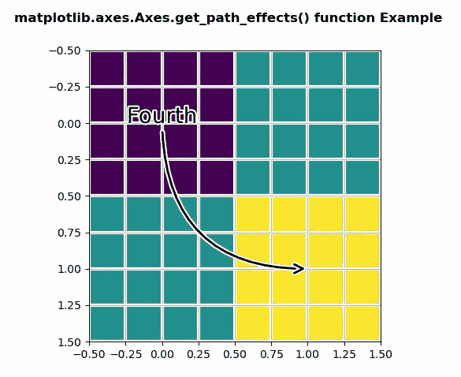

# Python 中的 matplotlib . axes . axes . get _ path _ effects()

> 原文:[https://www . geeksforgeeks . org/matplotlib-axes-axes-get _ path _ effects-in-python/](https://www.geeksforgeeks.org/matplotlib-axes-axes-get_path_effects-in-python/)

**[Matplotlib](https://www.geeksforgeeks.org/python-introduction-matplotlib/)** 是 Python 中的一个库，是 NumPy 库的数值-数学扩展。**轴类**包含了大部分的图形元素:轴、刻度、线二维、文本、多边形等。，并设置坐标系。Axes 的实例通过回调属性支持回调。

## matplotlib . axes . axes . get _ path _ effects()函数

matplotlib 库的 Axes 模块中的 **Axes.get_path_effects()函数**用来获取 set_path_effects 的属性。

> **语法:** Axes.get_path_effects(self)
> 
> **参数:**该方法不接受任何参数。
> 
> **返回:**该方法返回 set_path_effects 的属性。

下面的例子说明了 matplotlib.axes . axes . get _ path _ effects()函数在 matplotlib . axes 中的作用:

**例 1:**

```py
# Implementation of matplotlib function
import matplotlib.pyplot as plt
import numpy as np
import matplotlib.patheffects as path_effects

fig, ax = plt.subplots()
t = ax.text(0.02, 0.5,
            'GeeksForGeeks', 
            fontsize = 40,
            weight = 1000, 
            va ='center')

t.set_path_effects([path_effects.PathPatchEffect(offset =(4, -4), 
                                                 hatch ='xxxx',
                                                 facecolor ='gray'),
                    path_effects.PathPatchEffect(edgecolor ='white',
                                                 linewidth = 1.1,
                                                 facecolor ='black')])

print("Value Return by get_path_effects() : \n")
for i in t.get_path_effects():
    print(i)

fig.suptitle('matplotlib.axes.Axes.get_path_effects() \
function Example\n\n', fontweight ="bold")

plt.show()
```

**输出:**


```py
Value Return by get_path_effects() : 

<matplotlib.patheffects.PathPatchEffect object at 0x0B36CA90>
<matplotlib.patheffects.PathPatchEffect object at 0x0B36CC70>

```

**例 2:**

```py
# Implementation of matplotlib function
import matplotlib.pyplot as plt
import matplotlib.patheffects as PathEffects
import numpy as np

fig, ax1 = plt.subplots()
ax1.imshow([[1, 2], [2, 3]])
txt = ax1.annotate("Fourth",
                   (1., 1.), 
                   (0., 0),
                   arrowprops = dict(arrowstyle ="->",

                                     connectionstyle ="angle3", lw = 2),
                   size = 20, 
                   ha ="center", 
                   path_effects =[PathEffects.withStroke(linewidth = 3,
                                                         foreground ="w")])

txt.arrow_patch.set_path_effects([
    PathEffects.Stroke(linewidth = 5, foreground ="w"),
    PathEffects.Normal()])

ax1.grid(True, linestyle ="-")

pe = [PathEffects.withStroke(linewidth = 3,
                             foreground ="w")]

for l in ax1.get_xgridlines() + ax1.get_ygridlines():
    l.set_path_effects(pe)

print("Value Return by get_path_effects() : \n")

for l in ax1.get_xgridlines() + ax1.get_ygridlines():
    for i in l.get_path_effects():
        print(i)

fig.suptitle('matplotlib.axes.Axes.get_path_effects()\
function Example\n\n', fontweight ="bold")

plt.show()
```

**输出:**



```py
Value Return by get_path_effects() : 

<matplotlib.patheffects.withStroke object at 0x0B1DDDF0>
<matplotlib.patheffects.withStroke object at 0x0B1DDDF0>
<matplotlib.patheffects.withStroke object at 0x0B1DDDF0>
<matplotlib.patheffects.withStroke object at 0x0B1DDDF0>
<matplotlib.patheffects.withStroke object at 0x0B1DDDF0>
<matplotlib.patheffects.withStroke object at 0x0B1DDDF0>
<matplotlib.patheffects.withStroke object at 0x0B1DDDF0>
<matplotlib.patheffects.withStroke object at 0x0B1DDDF0>
<matplotlib.patheffects.withStroke object at 0x0B1DDDF0>
<matplotlib.patheffects.withStroke object at 0x0B1DDDF0>
<matplotlib.patheffects.withStroke object at 0x0B1DDDF0>
<matplotlib.patheffects.withStroke object at 0x0B1DDDF0>
<matplotlib.patheffects.withStroke object at 0x0B1DDDF0>
<matplotlib.patheffects.withStroke object at 0x0B1DDDF0>
<matplotlib.patheffects.withStroke object at 0x0B1DDDF0>
<matplotlib.patheffects.withStroke object at 0x0B1DDDF0>
<matplotlib.patheffects.withStroke object at 0x0B1DDDF0>
<matplotlib.patheffects.withStroke object at 0x0B1DDDF0>

```