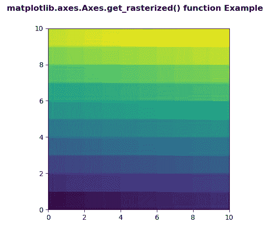

# Python 中的 matplotlib . axes . axes . get _ 栅格化()

> 原文:[https://www . geeksforgeeks . org/matplotlib-axes-axes-get _ 栅格化-in-python/](https://www.geeksforgeeks.org/matplotlib-axes-axes-get_rasterized-in-python/)

**[Matplotlib](https://www.geeksforgeeks.org/python-introduction-matplotlib/)** 是 Python 中的一个库，是 NumPy 库的数值-数学扩展。**轴类**包含了大部分的图形元素:轴、刻度、线二维、文本、多边形等。，并设置坐标系。Axes 的实例通过回调属性支持回调。

## matplotlib . axes . axes . get _ 栅格化()函数

matplotlib 库的 Axes 模块中的**axes . get _ 栅格化()函数**用于获取艺术家是否要栅格化。

> **语法:**坐标轴. get _ 栅格化(自身)
> 
> **参数:**该方法不接受任何参数。
> 
> **返回:**该方法返回艺术家是否要光栅化。

下面的例子说明了 matplotlib.axes . axes . get _ 栅格化()函数在 matplotlib . axes 中的作用:

**例 1:**

```py
# Implementation of matplotlib function
import numpy as np
import matplotlib.pyplot as plt

d = np.arange(100).reshape(10, 10)
xx, yy = np.meshgrid(np.arange(11), np.arange(11))

fig, ax = plt.subplots()

ax.set_aspect(1)
m = ax.pcolormesh(xx, yy, d)
if m.get_rasterized()== None:
    m.set_rasterized(True)

fig.suptitle('matplotlib.axes.Axes.get_rasterized() \
function Example', fontweight ="bold")

plt.show()
```

**输出:**


**例 2:**

```py
# Implementation of matplotlib function
import matplotlib.pyplot as plt
import matplotlib.colors as mcolors
import matplotlib.gridspec as gridspec
import numpy as np

arr = np.arange(100).reshape((10, 10))
norm = mcolors.Normalize(vmin = 0., vmax = 100.)

pc_kwargs = {'cmap': 'plasma', 'norm': norm}

fig, ax = plt.subplots( )

im = ax.pcolormesh(arr, **pc_kwargs)
fig.colorbar(im, ax = ax, shrink = 0.6)

if ax.get_rasterized()== None:
    ax.set_rasterized(False)

fig.suptitle('matplotlib.axes.Axes.get_rasterized()\
 function Example', fontweight ="bold")

plt.show()
```

**输出:**
