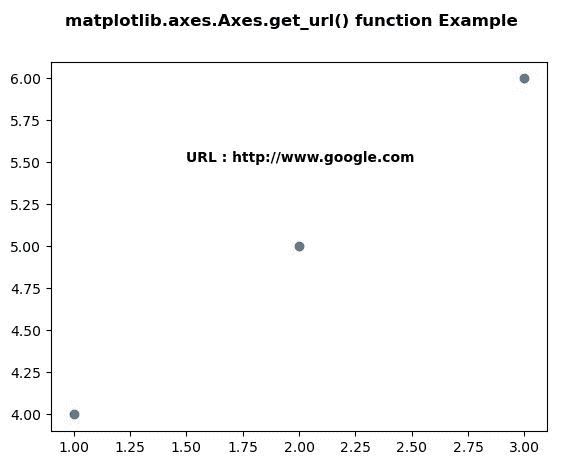

# matplotlib . axes . get _ URL()用 Python

表示

> 原文:[https://www . geeksforgeeks . org/matplotlib-axes-axes-get _ URL-in-python/](https://www.geeksforgeeks.org/matplotlib-axes-axes-get_url-in-python/)

**[Matplotlib](https://www.geeksforgeeks.org/python-introduction-matplotlib/)** 是 Python 中的一个库，是 NumPy 库的数值-数学扩展。**轴类**包含了大部分的图形元素:轴、刻度、线二维、文本、多边形等。，并设置坐标系。Axes 的实例通过回调属性支持回调。

## matplotlib.axes.Axes.get_url()函数

matplotlib 库的 Axes 模块中的 **Axes.get_url()函数**用于获取 url。

> **语法:**Axis . get _ URL(self)
> 
> **参数:**该方法不接受任何参数。
> 
> **返回:**这个方法返回网址。

下面的例子说明了 matplotlib.axes.Axes.get_url()函数在 matplotlib.axes 中的作用:

**例 1:**

```py
# Implementation of matplotlib function  
import numpy as np
import matplotlib.cm as cm
import matplotlib.mlab as mlab
import matplotlib.pyplot as plt

f, ax = plt.subplots()
ax.scatter([1, 2, 3], [4, 5, 6])
ax.set_url('http://www.google.com')
f.canvas.print_figure('scatter.svg')

ax.text(1.5, 5.5, "URL : "
        + str( ax.get_url()), 
        fontweight ="bold")

f.suptitle('matplotlib.axes.Axes.get_url() \
function Example\n', fontweight ="bold")

plt.show()
```

**输出:**


**例 2:**

```py
# Implementation of matplotlib function  
import numpy as np
import matplotlib.cm as cm
import matplotlib.mlab as mlab
import matplotlib.pyplot as plt

f, ax = plt.subplots()
delta = 0.025

x = y = np.arange(-3.0, 3.0, delta)
X, Y = np.meshgrid(x, y)

Z1 = np.exp(-X**2 - Y**2)
Z2 = np.exp(-(X - 1)**2 - (Y - 1)**2)
Z = (Z1 - Z2) * 2

ax.imshow(Z, interpolation ='bilinear', 
          cmap = cm.gray,
          origin ='lower',
          extent =[-3, 3, -3, 3])

ax.set_url('https://www.geeksforgeeks.org/')
f.savefig('image.svg')

ax.set_title("URL : "+str(ax.get_url()), fontweight ="bold")

f.suptitle('matplotlib.axes.Axes.get_url() function \
Example\n', fontweight ="bold")

plt.show()
```

**输出:**
