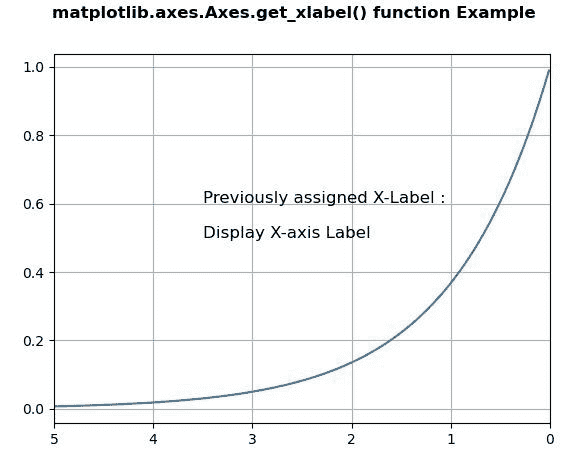
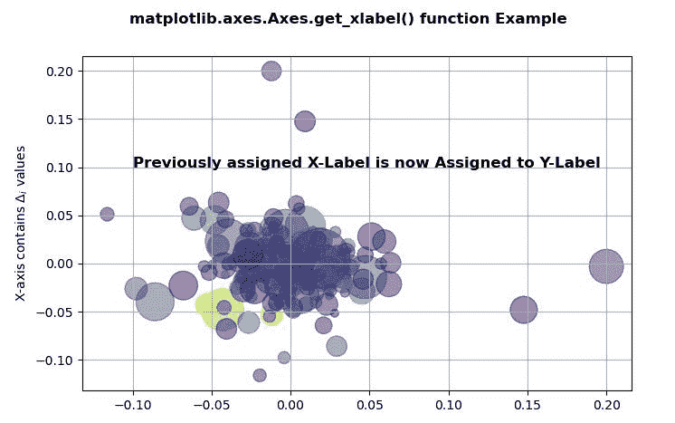

# matplotlib . axes . get _ xlabel()用 Python

表示

> 哎哎哎:# t0]https://www . geeksforgeeks . org/matplotlib-axes-get _ xlabel-in-python/

**[Matplotlib](https://www.geeksforgeeks.org/python-introduction-matplotlib/)** 是 Python 中的一个库，是 NumPy 库的数值-数学扩展。**轴类**包含了大部分的图形元素:轴、刻度、线二维、文本、多边形等。，并设置坐标系。Axes 的实例通过回调属性支持回调。

## matplotlib . axes . axes . get _ xlabel()函数

matplotlib 库的 Axes 模块中的 **Axes.get_xlabel()函数**用于获取 xlabel 文本字符串。

> **语法:** Axes.get_xlabel(self)
> 
> **参数:**该方法不接受任何参数。
> 
> **返回:**该函数返回 xlabel 文本字符串。

下面的例子说明了 matplotlib.axes . axes . get _ xlabel()函数在 matplotlib . axes 中的作用:

**例 1:**

```
import matplotlib.pyplot as plt
import numpy as np

t = np.arange(0.01, 5.0, 0.01)
s = np.exp(-t)

fig, ax = plt.subplots()

ax.plot(t, s)
ax.set_xlim(5, 0)
ax.set_xlabel('Display X-axis Label', fontweight ='bold')
ax.grid(True)

w = ax.get_xlabel()
ax.set_xlabel("")
ax.text(3.5, 0.5, "Previously assigned X-Label : \n\n"+str(w), 
        fontsize = 12)
fig.suptitle("matplotlib.axes.Axes.get_xlabel() function \
Example\n", fontweight ="bold")
plt.show()
```

**输出:**


**例 2:**

```
# Implementation of matplotlib function
import numpy as np
import matplotlib.pyplot as plt
import matplotlib.cbook as cbook

with cbook.get_sample_data('goog.npz') as datafile:
    price_data = np.load(datafile)['price_data'].view(np.recarray)

# get the most recent 250 trading days
price_data = price_data[-250:]  

delta1 = np.diff(price_data.adj_close) / price_data.adj_close[:-1]

volume = (25 * price_data.volume[:-2] / price_data.volume[0])**2
close = (0.03 * price_data.close[:-2] / 0.03 * price_data.open[:-2])**2

fig, ax = plt.subplots()
ax.scatter(delta1[:-1], delta1[1:],
           c = close, s = volume, 
           alpha = 0.5)

ax.set_xlabel(r'X-axis contains $\Delta_i$ values',
              fontweight ='bold')
ax.grid(True)

w = ax.get_xlabel()
ax.set_xlabel("")
ax.set_ylabel(w)
ax.text(-0.1, 0.1, "Previously assigned X-Label is now\
Assigned to Y-Label", fontsize = 12, fontweight ="bold")

fig.suptitle("matplotlib.axes.Axes.get_xlabel() \
function Example\n", fontweight ="bold")
plt.show()
```

**输出:**
