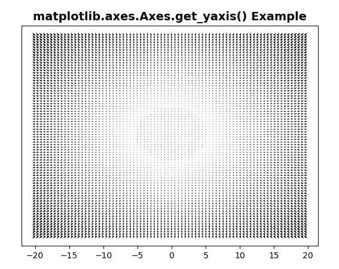
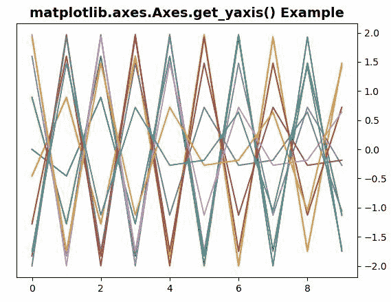

# matplotlib . axes . get _ yaxis()用 Python

表示

> 哎哎哎:# t0]https://www . geeksforgeeks . org/matplotlib-axes-get _ yaxis-in-python/

**[Matplotlib](https://www.geeksforgeeks.org/python-introduction-matplotlib/)** 是 Python 中的一个库，是 NumPy 库的数值-数学扩展。**轴类**包含了大部分的图形元素:轴、刻度、线二维、文本、多边形等。，并设置坐标系。Axes 的实例通过回调属性支持回调。

## matplotlib.axes.Axes.get_yaxis()函数

matplotlib 库的 Axes 模块中的 **Axes.get_yaxis()函数**返回 yaxis 实例。

> **语法:** Axes.get_yaxis(self)
> 
> **参数:**该方法不接受任何参数。
> 
> **返回:**该方法返回**雅西**实例。

下面的例子说明了 matplotlib.axes.Axes.get_yaxis()函数在 matplotlib.axes 中的作用:

**例 1:**

```
# Implementation of matplotlib function
import matplotlib.pyplot as plt
import numpy as np

X = np.arange(-20, 20, 0.5)
Y = np.arange(-20, 20, 0.5)
U, V = np.meshgrid(X, Y)

fig, ax = plt.subplots()
ax.quiver(X, Y, U, V)
w = ax.get_yaxis()
w.set_visible(False)
ax.set_title('matplotlib.axes.Axes.get_yaxis()\
 Example', fontsize = 14, fontweight ='bold')
plt.show()
```

**输出:**


**例 2:**

```
# Implementation of matplotlib function
import matplotlib.pyplot as plt
import numpy as np

x = np.linspace(0, 200, 10)
yy = np.transpose([2 * np.sin(x + phi) for phi in x])

fig, ax = plt.subplots()
ax.plot(yy)
w = ax.get_yaxis()
w.tick_right()
ax.set_title('matplotlib.axes.Axes.get_yaxis()\
 Example', fontsize = 14, fontweight ='bold')
plt.show()
```

**输出:**
