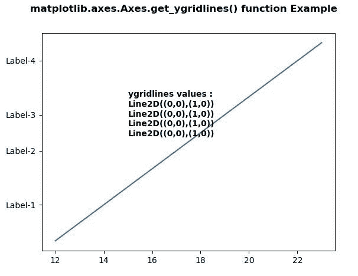
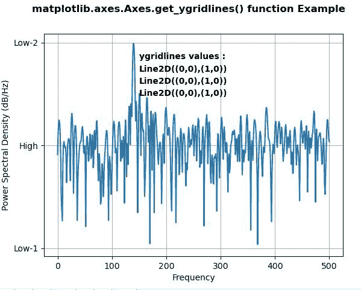

# Python 中的 matplotlib . axes . axes . get _ ygridline()

> 原文:[https://www . geeksforgeeks . org/matplotlib-axes-axes-get _ ygridlines-in-python/](https://www.geeksforgeeks.org/matplotlib-axes-axes-get_ygridlines-in-python/)

**[Matplotlib](https://www.geeksforgeeks.org/python-introduction-matplotlib/)** 是 Python 中的一个库，是 NumPy 库的数值-数学扩展。**轴类**包含了大部分的图形元素:轴、刻度、线二维、文本、多边形等。，并设置坐标系。Axes 的实例通过回调属性支持回调。

## matplotlib . axes . axes . get _ ygridlines()函数

matplotlib 库的 Axes 模块中的 **Axes.get_ygridlines()函数**用于将 y 网格线作为 Line2D 实例的列表返回。

> **语法:**axes . get _ ygridline(self)
> 
> **参数:**该方法不接受任何参数。
> 
> **返回值:**该方法返回 y 网格线作为线 2D 实例列表。

下面的例子说明了 matplotlib.axes . axes . get _ ygridlines()函数在 matplotlib . axes 中的作用:

**例 1:**

```
# Implementation of matplotlib function
import matplotlib.pyplot as plt
import matplotlib.transforms as mtransforms

fig, ax = plt.subplots()
ax.plot(range(12, 24), range(12))
ax.set_yticks((2, 5, 7, 10))
ax.set_yticklabels(("Label-1", "Label-2",
                    "Label-3", "Label-4"))

w = ax.get_ygridlines()
ax.text(15, 8, "ygridlines values : ", 
       fontweight ="bold")
xx = 8
for i in w:
    ax.text(15, xx-0.55, str(i), 
           fontweight ="bold")
    xx-= 0.55

fig.suptitle('matplotlib.axes.Axes.get_ygridlines()\
 function Example\n\n', fontweight ="bold")
plt.show()
```

**输出:**


**例 2:**

```
# Implementation of matplotlib function
import matplotlib.pyplot as plt
import numpy as np
import matplotlib.mlab as mlab
import matplotlib.gridspec as gridspec

fs = 1000
t = np.linspace(0, 0.3, 301)
A = np.array([2, 8]).reshape(-1, 1)
f = np.array([150, 140]).reshape(-1, 1)
xn = (A * np.sin(2 * np.pi * f * t)).sum(axis = 0)
xn += 5 * np.random.randn(*t.shape)

fig, ax = plt.subplots()

yticks = [-40, -15, 10]

ax.psd(xn, NFFT = 301, Fs = fs, 
      window = mlab.window_none, 
      pad_to = 1024,
      scale_by_freq = True)

ax.set_yticks(yticks)
ax.set_yticklabels(("Low-1", "High", "Low-2"))
ax.grid(True)

w = ax.get_ygridlines()
ax.text(150, 6, "ygridlines values : ", 
        fontweight ="bold")
xx = 6
for i in w:
    ax.text(150, xx-3, str(i), fontweight ="bold")
    xx-= 3

fig.suptitle('matplotlib.axes.Axes.get_ygridlines()\
 function Example\n\n', fontweight ="bold")
plt.show()
```

**输出:**
