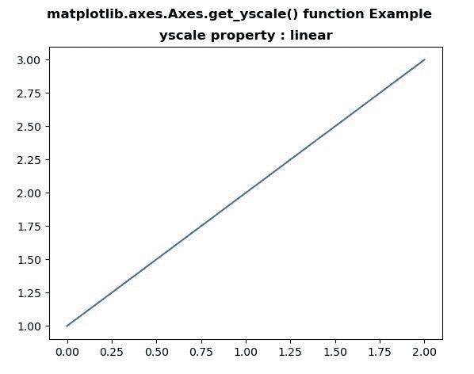
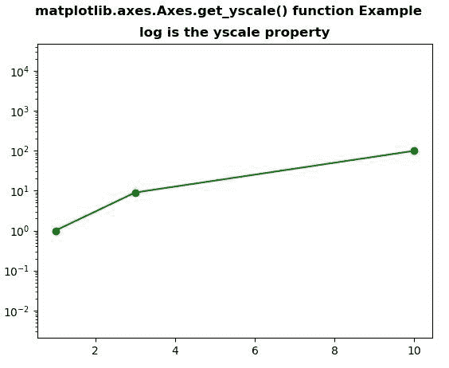

# Python 中的 matplotlib . axes . axes . get _ yscale()

> 原文:[https://www . geeksforgeeks . org/matplotlib-axes-axes-get _ yscale-in-python/](https://www.geeksforgeeks.org/matplotlib-axes-axes-get_yscale-in-python/)

**[Matplotlib](https://www.geeksforgeeks.org/python-introduction-matplotlib/)** 是 Python 中的一个库，是 NumPy 库的数值-数学扩展。**轴类**包含了大部分的图形元素:轴、刻度、线二维、文本、多边形等。，并设置坐标系。Axes 的实例通过回调属性支持回调。

## matplotlib . axes . axes . get _ yscale()函数

matplotlib 库的 Axes 模块中的**Axis . get _ yscale()函数**用于获取字符串形式的 y 轴比例。

> **语法:** Axes.get_yscale(self)
> 
> **参数:**该方法不接受任何参数。
> 
> **返回:**该函数将 y 轴刻度作为字符串返回。

下面的例子说明了 matplotlib.axes . axes . get _ yscale()函数在 matplotlib . axes 中的作用:

**例 1:**

```py
# Implementation of matplotlib function
import matplotlib.pyplot as plt
import numpy as np

fig, ax = plt.subplots()

ax.plot([1, 2, 3])

w = ax.get_yscale()

ax.set_title("yscale property : "+ str(w),
             fontweight ="bold")
fig.suptitle('matplotlib.axes.Axes.get_yscale() \
function Example\n', fontweight ="bold")
fig.canvas.draw()
plt.show()
```

**输出:**


**例 2:**

```py
# Implementation of matplotlib function
import matplotlib.pyplot as plt

fig, ax = plt.subplots()

ax.set_yscale("log")
ax.set_adjustable("datalim")
ax.plot([1, 3, 10], [1, 9, 100], "o-", color ="green")
ax.set_ylim(1e-1, 1e3)
ax.set_aspect(1)
w = ax.get_yscale()
ax.set_title(str(w)+" is the yscale property",
             fontweight ="bold")
fig.suptitle('matplotlib.axes.Axes.get_yscale()\
 function Example\n', fontweight ="bold")

plt.show()
```

**输出:**
