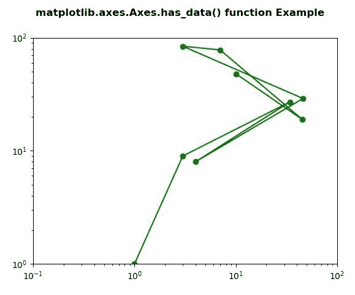

# Python 中的 Matplotlib.axes.Axes.has_data()

> 原文:[https://www . geeksforgeeks . org/matplotlib-axes-axes-has _ data-in-python/](https://www.geeksforgeeks.org/matplotlib-axes-axes-has_data-in-python/)

**[Matplotlib](https://www.geeksforgeeks.org/python-introduction-matplotlib/)** 是 Python 中的一个库，是 NumPy 库的数值-数学扩展。**轴类**包含了大部分的图形元素:轴、刻度、线二维、文本、多边形等。，并设置坐标系。Axes 的实例通过回调属性支持回调。

## matplotlib.axes.Axes.has_data()函数

matplotlib 库的 Axes 模块中的 **Axes.has_data()函数**用于检查是否有任何艺术家被添加到轴中。

> **语法:** Axes.has_data(self)
> 
> **参数:**该方法不接受任何参数。
> 
> **返回:**如果有任何艺术家被添加到轴上，该方法返回真。

下面的例子说明了 matplotlib.axes.Axes.has_data()函数在 matplotlib.axes 中的作用:

**例 1:**

```
# ImpleIn Reviewtation of matplotlib function  
import matplotlib.pyplot as plt

fig, ax1 = plt.subplots( )
ax1.set_xscale("log")
ax1.set_yscale("log")
ax1.set_adjustable("datalim")

ax1.plot([1, 3, 34, 4, 46, 3, 7, 45, 10],
         [1, 9, 27, 8, 29, 84, 78, 19, 48],
          "o-", color ="green")

ax1.set_xlim(1e-1, 1e2)
ax1.set_ylim(1, 1e2)

w = ax1.has_data()

print("Value Return by has_data() :", w)

fig.suptitle('matplotlib.axes.Axes.has_data()\
 function Example\n\n', fontweight ="bold")

fig.canvas.draw()

plt.show()
```

**输出:**



```
Value Return by has_data() : True

```

**例 2:**

```
# ImpleIn Reviewtation of matplotlib function  
import matplotlib.pyplot as plt
import matplotlib.tri as tri
import numpy as np

n_angles = 36
n_radii = 10
min_radius = 2
radii = np.linspace(min_radius, 0.95, n_radii)

angles = np.linspace(0, 2 * np.pi, n_angles,
                     endpoint = False)
angles = np.repeat(angles[..., np.newaxis], 
                   n_radii, axis = 1)
angles[:, 1::2] += 2 * np.pi / n_angles

x = (radii * np.cos(angles)).flatten()
y = (radii * np.sin(angles)).flatten()

triang = tri.Triangulation(x, y)

triang.set_mask(np.hypot(x[triang.triangles].mean(axis = 1),
                         y[triang.triangles].mean(axis = 1))
                < min_radius)
fig, ax = plt.subplots()

ax.triplot(triang, 'bo-', lw = 1, color = "green")

w = ax.has_data()

print("Value Return by has_data() :", w)

fig.suptitle('matplotlib.axes.Axes.has_data() function\
 Example\n\n', fontweight ="bold")

fig.canvas.draw()

plt.show()
```

**输出:**


```
Value Return by has_data() : True

```