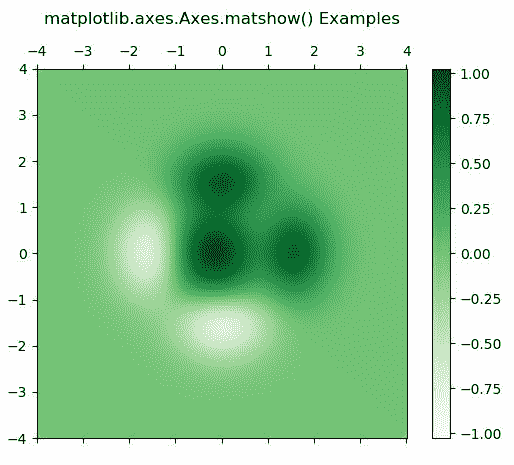
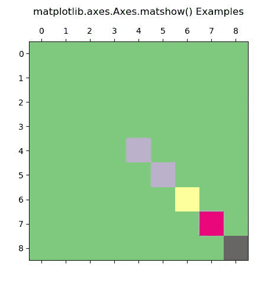

# matplot lib . axes . axes . matshow()中的 Python

> 原文:[https://www . geeksforgeeks . org/matplotlib-axes-axes-matshow-in-python/](https://www.geeksforgeeks.org/matplotlib-axes-axes-matshow-in-python/)

**[Matplotlib](https://www.geeksforgeeks.org/python-introduction-matplotlib/)** 是 Python 中的一个库，是 NumPy 库的数值-数学扩展。**轴类**包含了大部分的图形元素:轴、刻度、线二维、文本、多边形等。，并设置坐标系。Axes 的实例通过回调属性支持回调。

## matplotlib.axes.Axes.matshow()函数

matplotlib 库的 Axes 模块中的 **Axes.matshow()函数**也用于将 2D 矩阵或数组的值绘制为彩色编码图像。

> **语法:**
> 
> ```py
> Axes.matshow(self, Z, **kwargs)
> ```
> 
> **参数:**该方法接受以下描述的参数:
> 
> *   **z:** 该参数包含要显示的矩阵。
> 
> **返回:**这将返回以下内容:
> 
> *   **图像:**这将返回**轴图像**

下面的例子说明了 matplotlib.axes.Axes.imshow()函数在 matplotlib.axes 中的作用:

**示例-1:**

```py
# Implementation of matplotlib function
import matplotlib.pyplot as plt
import numpy as np
from matplotlib.colors import LogNorm

dx, dy = 0.015, 0.05
y, x = np.mgrid[slice(-4, 4 + dy, dy),
                slice(-4, 4 + dx, dx)]
z = (1 - x / 3\. + x ** 5 + y ** 5) * np.exp(-x ** 2 - y ** 2)
z = z[:-1, :-1]

z_min, z_max = -np.abs(z).max(),
np.abs(z).max()

fig, ax = plt.subplots()

c = ax.matshow(z, cmap ='Greens',
               vmin = z_min,
               vmax = z_max,
              extent =[x.min(),
                       x.max(), 
                       y.min(),
                       y.max()],
              interpolation ='nearest',
               origin ='lower')

fig.colorbar(c, ax = ax)
ax.set_title('matplotlib.axes.Axes.matshow() Examples\n')
plt.show()
```

**输出:**


**示例-2:**

```py
# Implementation of matplotlib function
import matplotlib.pyplot as plt
import numpy as np

def samplemat(dims):
    """Make a matrix with all zeros and increasing 
       elements on the diagonal"""

    aa = np.zeros(dims)
    for i in range(min(dims)):
        aa[i, i] = np.sin(i**3)**2 + i**3
    return aa

# Display matrix  
fig, ax = plt.subplots()
ax.matshow(samplemat((9, 9)), cmap ="Accent")

ax.set_title('matplotlib.axes.Axes.matshow() Examples\n')
plt.show()
```

**输出:**
