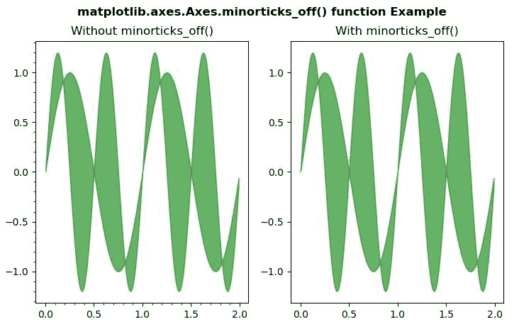

# Python 中的 matplotlib . axes . axes . min articks _ off()

> 原文:[https://www . geeksforgeeks . org/matplotlib-axes-axes-min articks _ off-in-python/](https://www.geeksforgeeks.org/matplotlib-axes-axes-minorticks_off-in-python/)

**[Matplotlib](https://www.geeksforgeeks.org/python-introduction-matplotlib/)** 是 Python 中的一个库，是 NumPy 库的数值-数学扩展。**轴类**包含了大部分的图形元素:轴、刻度、线二维、文本、多边形等。，并设置坐标系。Axes 的实例通过回调属性支持回调。

## matplotlib . axes . axes . min articks _ off()函数

matplotlib 库的 Axes 模块中的**axes . minarticks _ off()函数**用于去除轴上的小记号。

**语法:**

```py
Axes.minorticks_off(self)

```

**注意:**使用 minorticks_on()功能后，如果使用该功能，将显示任何变化或效果。

下面的例子说明了 matplotlib.axes . axes . min articks _ off()函数在 matplotlib . axes 中的作用:

**例 1:**

```py
# Implementation of matplotlib function
import numpy as np
import matplotlib.pyplot as plt

fig, ax1 = plt.subplots()

ax1.minorticks_on()

np.random.seed(19680801)
mu, sigma = 100, 15
x = mu + sigma * np.random.randn(10000)

ax1.hist(x, 50, density = True, facecolor ='g',
         alpha = 0.65)

ax1.set_xlim(40, 160)
ax1.set_ylim(0, 0.03)
plt.grid(True)

ax1.minorticks_off()
fig.suptitle('matplotlib.axes.Axes.minorticks_off()\
 function Example\n\n', fontweight ="bold")
plt.show()
```

**输出:**


**例 2:**

```py
# Implementation of matplotlib function
import matplotlib.pyplot as plt
import numpy as np

x = np.arange(0.0, 2, 0.01)
y1 = np.sin(2 * np.pi * x)
y2 = 1.2 * np.sin(4 * np.pi * x)

fig, (ax, ax1) = plt.subplots(1, 2)

ax.minorticks_on()
ax1.minorticks_on()

ax.fill_between(x, y1, y2, color ="green", 
                alpha = 0.6)
ax.set_title("Without minorticks_off()")

ax1.fill_between(x, y1, y2, color ="green",
                 alpha = 0.6)
ax1.set_title("With minorticks_off()")
ax1.minorticks_off()

fig.suptitle('matplotlib.axes.Axes.minorticks_off() \
function Example\n\n', fontweight ="bold")
plt.show()
```

**输出:**
