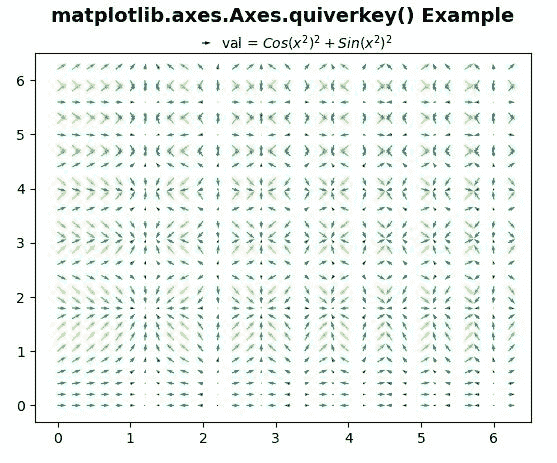

# matplotlib . axes . quiverey()在 Python

中

> 哎哎哎:# t0]https://www . geeksforgeeks . org/matplotlib-axes-quiverey-in-python/

**[Matplotlib](https://www.geeksforgeeks.org/python-introduction-matplotlib/)** 是 Python 中的一个库，是 NumPy 库的数值-数学扩展。**轴类**包含了大部分的图形元素:轴、刻度、线二维、文本、多边形等。，并设置坐标系。Axes 的实例通过回调属性支持回调。

## matplotlib.axes.Axes.quiverkey()函数

matplotlib 库的 Axes 模块中的 **Axes.quiverkey()函数**也用于为颤图添加一个键。

> **语法:** Axes.quiverkey(self，Q，X，Y，U，label，**kw)
> 
> **参数:**该方法接受以下描述的参数:
> 
> *   **Q:** 这个参数是对颤的调用返回的颤实例。
> *   **X，Y :** 这些参数是按键位置的 X 和 Y 坐标。
> *   **U:** 此参数为按键长度。
> *   **标签:**该参数是一个字符串，带有密钥的长度和单位。
> *   **角度:**此参数为箭头的角度。
> *   **颜色:**该参数是来自于 q 的覆盖面和边缘颜色
> *   **标签页:**该参数用于将标签定位在箭头的上方、下方、右侧、左侧。
> *   **标签页:**此参数是箭头和标签之间的距离，单位为英寸。
> *   **标签颜色:**默认为默认文本颜色。
> *   **fontproperties:** 这个参数是 fontproperties 初始化器接受的带有关键字参数的字典:系列、样式、变体、大小、权重。

下面的例子说明了 matplotlib.axes.Axes.quiverkey()函数在 matplotlib.axes 中的作用:

**例 1:**

```py
# Implementation of matplotlib function
import matplotlib.pyplot as plt
import numpy as np

X = np.arange(-20, 20, 0.5)
Y = np.arange(-20, 20, 0.5)
U, V = np.meshgrid(X, Y)

fig, ax = plt.subplots()
q = ax.quiver(X, Y, U, V)
ax.quiverkey(q, X = 0.5, Y = 0.5, U = 500,
             label ='Quiver key')

ax.set_title('matplotlib.axes.Axes.quiverkey() \
Example', fontsize = 14, fontweight ='bold')
plt.show()
```

**输出:**


**例 2:**

```py
# Implementation of matplotlib function
import matplotlib.pyplot as plt
import numpy as np

X, Y = np.meshgrid(np.arange(0, 2 * np.pi, .2), np.arange(0, 2 * np.pi, .2))
U = np.cos(X**2)
V = np.sin(Y**2)
C = U**2 + V**2

fig, ax = plt.subplots()
Q = ax.quiver(X, Y, U, V, C, units ='width')
ax.quiverkey(Q, 0.4, 0.9, 1,
             r'val = $Cos(x ^ 2)^2 + Sin(x ^ 2)^2{content}apos;,
             labelpos ='E',
             coordinates ='figure')

ax.set_title('matplotlib.axes.Axes.quiverkey() \
Example\n', fontsize = 14, fontweight ='bold')
plt.show()
```

**输出:**
