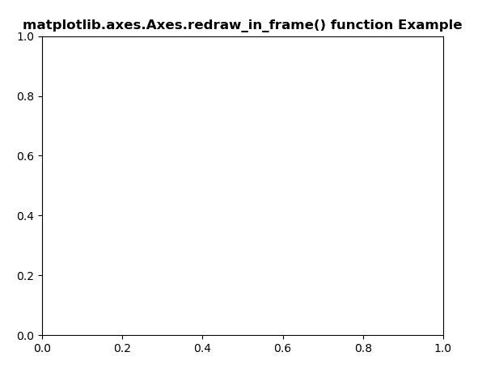
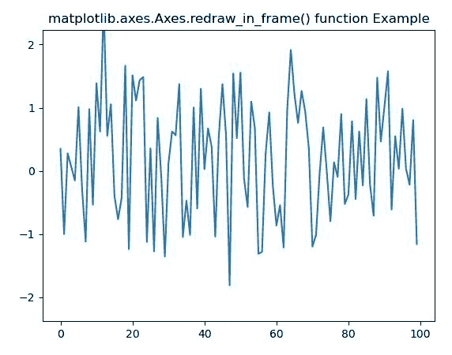

# Python 中的 matplotlib . axes . axes . redraw _ in _ frame()

> 原文:[https://www . geeksforgeeks . org/matplotlib-axes-axes-redraw _ in _ frame-in-python/](https://www.geeksforgeeks.org/matplotlib-axes-axes-redraw_in_frame-in-python/)

**[Matplotlib](https://www.geeksforgeeks.org/python-introduction-matplotlib/)** 是 Python 中的一个库，是 NumPy 库的数值-数学扩展。**轴类**包含了大部分的图形元素:轴、刻度、线二维、文本、多边形等。，并设置坐标系。Axes 的实例通过回调属性支持回调。

## matplotlib . axes . axes . redraw _ in _ frame()函数

matplotlib 库的 axes 模块中的 **Axes.redraw_in_frame()函数**用于高效更新 Axes 数据。

> **语法:** Axes.redraw_in_frame(自身)
> 
> **参数:**该方法不接受任何参数。
> 
> **返回:**该方法不返回值。

**注意:**该方法只能在缓存渲染器的初始绘制后使用。

下面的例子说明了 matplotlib.axes . axes . redraw _ in _ frame()函数在 matplotlib . axes 中的作用:

**例 1:**

```
# Implementation of matplotlib function 
import matplotlib.pyplot as plt

fig, ax = plt.subplots() 

def tellme(s): 
    ax.set_title(s, fontsize = 12, fontweight ="bold") 
    fig.canvas.draw()
    ax.redraw_in_frame()

tellme('matplotlib.axes.Axes.redraw_in_frame() function \
Example') 

plt.show() 
```

**输出:**


**例 2:**

```
# Implementation of matplotlib function 
import matplotlib.pyplot as plt
import numpy as np
import time

fig, ax = plt.subplots()
line, = ax.plot(np.random.randn(100))

tstart = time.time()
num_plots = 0
fig.canvas.draw()
while time.time()-tstart < 5:
    line.set_ydata(np.random.randn(100))
    ax.redraw_in_frame()
    num_plots += 1

ax.set_title('matplotlib.axes.Axes.redraw_in_frame() \
function Example') 

plt.show() 
```

**输出:**
