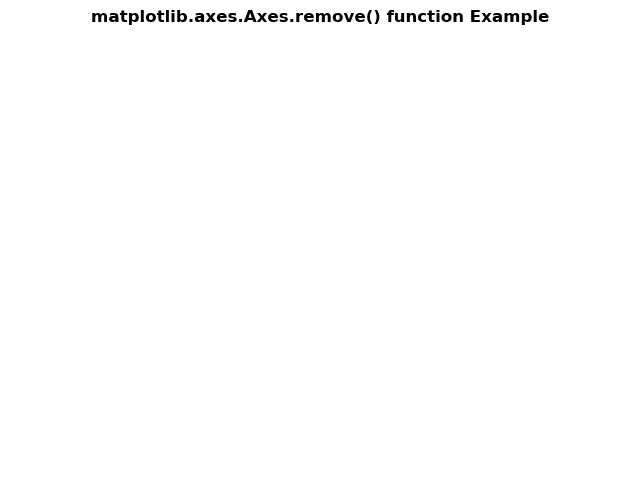

# Python 中的 Matplotlib.axes.Axes.remove()

> 原文:[https://www . geesforgeks . org/matplotlib-axes-axes-remove-in-python/](https://www.geeksforgeeks.org/matplotlib-axes-axes-remove-in-python/)

**[Matplotlib](https://www.geeksforgeeks.org/python-introduction-matplotlib/)** 是 Python 中的一个库，是 NumPy 库的数值-数学扩展。**轴类**包含了大部分的图形元素:轴、刻度、线二维、文本、多边形等。，并设置坐标系。Axes 的实例通过回调属性支持回调。

## matplotlib.axes.Axes.remove()函数

matplotlib 库的 Axes 模块中的 **Axes.remove()函数**用于在可能的情况下从图形中移除艺术家。

**语法:**

```py
Axes.remove(self)

```

下面的例子说明了 matplotlib.axes.Axes.remove()函数在 matplotlib.axes 中的作用:

**例 1:**

```py
# Implementation of matplotlib function
import matplotlib.pyplot as plt

fig, axs = plt.subplots()
axs.plot([1, 2, 3])
axs.remove()

fig.suptitle('matplotlib.axes.Axes.remove()\
 function Example', fontweight ="bold")

plt.show()
```

**输出:**


**例 2:**

```py
# Implementation of matplotlib function
import matplotlib.pyplot as plt

fig, (axs, axs2) = plt.subplots(2, 1)
gs = axs2.get_gridspec()

axs.remove()

axbig = fig.add_subplot(gs[1:, -1])
axbig.annotate("Removed one Axes",
               (0.4, 0.5),
               xycoords ='axes fraction',
               va ='center')

fig.suptitle('matplotlib.axes.Axes.remove()\
 function Example', fontweight ="bold")
plt.show()
```

**输出:**
