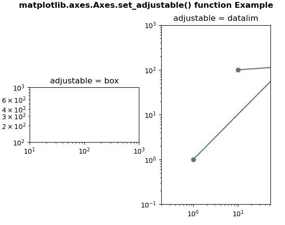
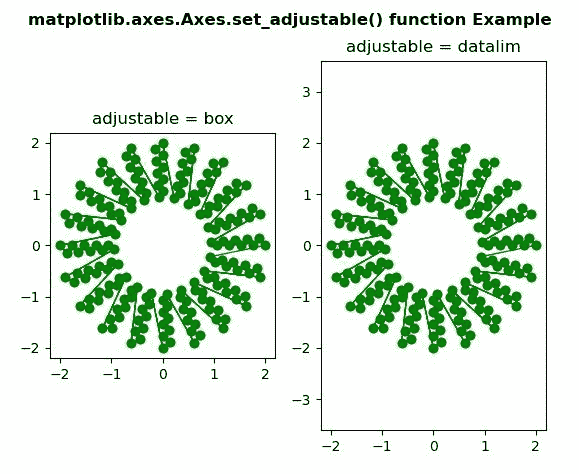

# Python 中的 matplotlib . axes . axes . set _ 可调()

> 原文:[https://www . geesforgeks . org/matplotlib-axes-axes-set _ 可调-in-python/](https://www.geeksforgeeks.org/matplotlib-axes-axes-set_adjustable-in-python/)

**[Matplotlib](https://www.geeksforgeeks.org/python-introduction-matplotlib/)** 是 Python 中的一个库，是 NumPy 库的数值-数学扩展。**轴类**包含了大部分的图形元素:轴、刻度、线二维、文本、多边形等。，并设置坐标系。Axes 的实例通过回调属性支持回调。

## matplotlib . axes . axes . set _ 可调()函数

matplotlib 库的 axes 模块中的**Axes . set _ 可调()函数**用于定义 Axes 将改变哪个参数来实现给定的方面。

> **语法:**axes . set _ 可调(自身，可调，共享=False)
> 
> **参数:**该方法接受以下参数。
> 
> *   **可调:**这定义了将调整哪个参数以满足所需的方面。
> *   **共享:**此参数用于将设置应用于所有共享轴。
> 
> **返回值:**此方法不返回值。

以下示例说明了 matplotlib.axes . axes . set _ 可调()函数在 matplotlib . axes 中的作用:

**例 1:**

```
# ImpleIn Reviewtation of matplotlib function  
import matplotlib.pyplot as plt

fig, (ax1, ax2) = plt.subplots(1, 2)
ax1.set_xscale("log")
ax1.set_yscale("log")
ax1.set_xlim(1e1, 1e3)
ax1.set_ylim(1e2, 1e3)
ax1.set_aspect(1)
ax1.set_title("adjustable = box")

ax2.set_xscale("log")
ax2.set_yscale("log")
ax2.set_adjustable("datalim")
ax2.plot([1, 113, 10], [1, 119, 100], "o-")
ax2.set_xlim(1e-1, 1e2)
ax2.set_ylim(1e-1, 1e3)
ax2.set_aspect(1)
ax2.set_title("adjustable = datalim")

fig.suptitle('matplotlib.axes.Axes.set_adjustable() \
function Example\n', fontweight ="bold")
fig.canvas.draw()
plt.show()
```

**输出:**


**例 2:**

```
# ImpleIn Reviewtation of matplotlib function  
import matplotlib.pyplot as plt
import matplotlib.tri as tri
import numpy as np

n_angles = 40
n_radii = 10
min_radius = 2
radii = np.linspace(min_radius, 0.95, n_radii)

angles = np.linspace(0, 4 * np.pi, n_angles, endpoint = False)
angles = np.repeat(angles[..., np.newaxis], n_radii, axis = 1)
angles[:, 1::2] += np.pi / n_angles

x = (radii * np.cos(angles)).flatten()
y = (radii * np.sin(angles)).flatten()

triang = tri.Triangulation(x, y)

triang.set_mask(np.hypot(x[triang.triangles].mean(axis = 1),
                         y[triang.triangles].mean(axis = 1))
                < min_radius)
fig, (ax, ax1) = plt.subplots(1, 2)

ax.triplot(triang, 'bo-', lw = 1, color = "green")
ax.set_aspect('equal')
ax.set_title("adjustable = box")

ax1.set_aspect('equal')
ax1.set_adjustable("datalim")
ax1.triplot(triang, 'bo-', lw = 1, color = "green")
ax1.set_title("adjustable = datalim")

fig.suptitle('matplotlib.axes.Axes.set_adjustable() \
function Example\n', fontweight ="bold")
fig.canvas.draw()
plt.show()
```

**输出:**
