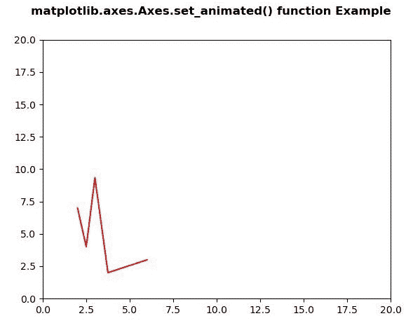
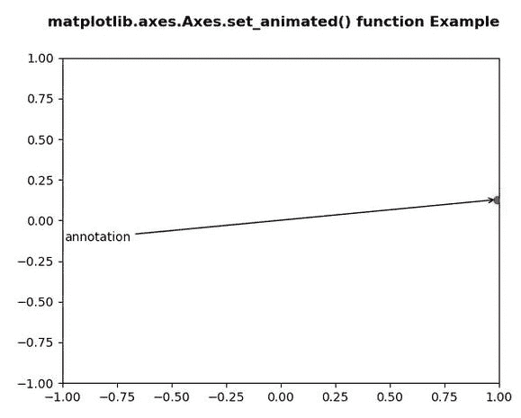

# Python 中的 matplotlib . axes . axes . set _ animated()

> 原文:[https://www . geesforgeks . org/matplotlib-axes-axes-set _ animated-in-python/](https://www.geeksforgeeks.org/matplotlib-axes-axes-set_animated-in-python/)

**[Matplotlib](https://www.geeksforgeeks.org/python-introduction-matplotlib/)** 是 Python 中的一个库，是 NumPy 库的数值-数学扩展。**轴类**包含了大部分的图形元素:轴、刻度、线二维、文本、多边形等。，并设置坐标系。Axes 的实例通过回调属性支持回调。

## matplotlib . axes . axes . set _ animated()函数

matplotlib 库的 Axes 模块中的 **Axes.set_animated()函数**用于设置艺术家的动画状态。

> **语法:** Axes.set_animated(self，b)
> 
> **参数:**该方法只接受一个参数。
> 
> *   **b:** 该参数为包含布尔值。
> 
> **返回:**该方法不返回值。

下面的例子说明了 matplotlib.axes . axes . set _ animated()函数在 matplotlib . axes 中的作用:

**例 1:**

```
# Implementation of matplotlib function
import numpy as np
import matplotlib.pyplot as plt
import matplotlib.animation as animation

data = np.array([[1, 2, 3, 4, 5], 
                 [7, 4, 9, 2, 3]])

fig = plt.figure()
ax = plt.axes(xlim =(0, 20), ylim =(0, 20))

line, = ax.plot([], [], 'r-')
annotation = ax.annotate('',
                         xy =(data[0][0],
                              data[1][0]))

annotation.set_animated(True)

def init():
    return line, annotation

def update(num):
    newData = np.array([[1 + num,
                         2 + num / 2,
                         3,
                         4 - num / 4,
                         5 + num],
                        [7, 4, 
                         9 + num / 3,
                         2, 3]])

    line.set_data(newData)
    return line, annotation

anim = animation.FuncAnimation(fig,
                               update, 
                               frames = 25,
                               init_func = init,
                               interval = 200,
                               blit = True)

fig.suptitle('matplotlib.axes.Axes.set_animated() \
function Example\n\n', fontweight ="bold")

plt.show()
```

**输出:**


**例 2:**

```
# Implementation of matplotlib function
import numpy as np
import matplotlib.pyplot as plt
import matplotlib.animation as animation

fig, ax = plt.subplots()

ax.set_xlim([-1, 1])
ax.set_ylim([-1, 1])

L = 50
theta = np.linspace(0, 2 * np.pi, L)
r = np.ones_like(theta)

x = r * np.cos(theta)
y = r * np.sin(theta)

line, = ax.plot(1, 0, 'ro')

annotation = ax.annotate(
    'annotation', xy =(1, 0), xytext =(-1, 0),
    arrowprops = {'arrowstyle': "->"}
)
annotation.set_animated(False)

def update(i):

    new_x = x[i % L]
    new_y = y[i % L]
    line.set_data(new_x, new_y)

    annotation.set_position((-new_x, -new_y))
    annotation.xy = (new_x, new_y)

    return line, annotation

ani = animation.FuncAnimation(
    fig, update, interval = 500, blit = False
)

fig.suptitle('matplotlib.axes.Axes.set_animated()\
 function Example\n\n', fontweight ="bold")

plt.show()
```

**输出:**
