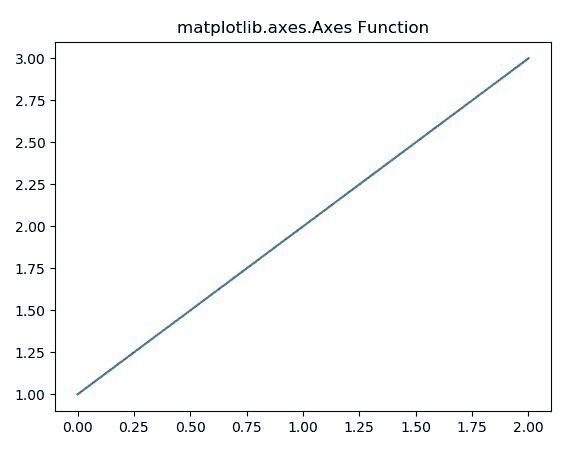
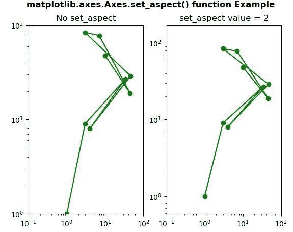
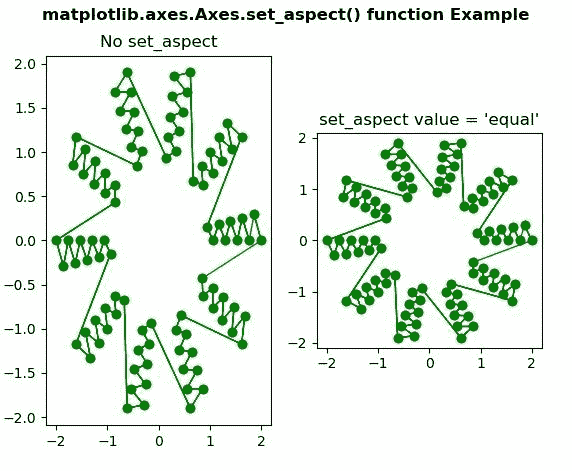

# matplotlib . axes . set _ aspect()用 Python

表示

> 哎哎哎:# t0]https://www . geeksforgeeks . org/matplot lib-axes-set _ aspect-in-python/

**[Matplotlib](https://www.geeksforgeeks.org/python-introduction-matplotlib/)** 是 Python 中的一个库，是 NumPy 库的数值-数学扩展。

**轴类**包含大部分图形元素:轴、刻度、线 2D、文本、多边形等。，并设置坐标系。Axes 的实例通过回调属性支持回调。
**#样本代码**

```py
# Implementation of matplotlib function

import matplotlib.pyplot as plt
import numpy as np

# make an agg figure
fig, ax = plt.subplots()
ax.plot([1, 2, 3])
ax.set_title('matplotlib.axes.Axes function')
fig.canvas.draw()
plt.show()
```

**输出:**


## matplotlib . axes . axes . set _ aspect()函数

matplotlib 库的 Axes 模块中的 **Axes.set_aspect()函数**用于设置轴缩放的纵横比，即 y 单位与 x 单位的比值。

**语法:**

> Axes.set_aspect(自身，方面，可调=无，锚=无，共享=假)

**参数:**该方法接受以下参数。

*   **方面:**此参数接受以下值{'auto '，' equal'}或 num。
*   **可调:**这定义了将调整哪个参数以满足所需的方面。
*   **锚点:**此参数用于定义如果由于方面限制而有额外空间，轴将绘制在哪里。
*   **共享:**此参数用于将设置应用于所有共享轴。

**返回值:**此方法不返回值。

下面的例子说明了 matplotlib.axes . axes . set _ aspect()函数在 matplotlib . axes 中的作用:

**示例-1:**

```py
# ImpleIn Reviewtation of matplotlib function  
import matplotlib.pyplot as plt

fig, (ax1, ax2) = plt.subplots(1, 2)
ax1.set_xscale("log")
ax1.set_yscale("log")
ax1.set_adjustable("datalim")
ax1.plot([1, 3, 34, 4, 46, 3, 7, 45, 10],
         [1, 9, 27, 8, 29, 84, 78, 19, 48],
         "o-", color ="green")
ax1.set_xlim(1e-1, 1e2)
ax1.set_ylim(1, 1e2)
ax1.set_title("No set_aspect")

ax2.set_xscale("log")
ax2.set_yscale("log")
ax2.set_adjustable("datalim")
ax2.plot([1, 3, 34, 4, 46, 3, 7, 45, 10],
         [1, 9, 27, 8, 29, 84, 78, 19, 48],
         "o-", color ="green")

ax2.set_xlim(1e-1, 1e2)
ax2.set_ylim(1, 1e2)
ax2.set_aspect(2)
ax2.set_title("set_aspect value = 2")

fig.suptitle('matplotlib.axes.Axes.set_aspect() \
function Example\n', fontweight ="bold")
fig.canvas.draw()
plt.show()
```

**输出:**


**示例-2:**

```py
# ImpleIn Reviewtation of matplotlib function  
import matplotlib.pyplot as plt
import matplotlib.tri as tri
import numpy as np

n_angles = 20
n_radii = 10
min_radius = 2
radii = np.linspace(min_radius, 0.95, n_radii)

angles = np.linspace(0, 4 * np.pi, n_angles,
                     endpoint = False)
angles = np.repeat(angles[..., np.newaxis],
                   n_radii, axis = 1)
angles[:, 1::2] += np.pi / n_angles

x = (radii * np.cos(angles)).flatten()
y = (radii * np.sin(angles)).flatten()

triang = tri.Triangulation(x, y)

triang.set_mask(np.hypot(x[triang.triangles].mean(axis = 1),
                         y[triang.triangles].mean(axis = 1))
                < min_radius)
fig, (ax, ax1) = plt.subplots(1, 2)

ax.triplot(triang, 'bo-', lw = 1, color = "green")
ax.set_title("No set_aspect")

ax1.set_aspect('equal')
ax1.triplot(triang, 'bo-', lw = 1, color = "green")
ax1.set_title("set_aspect value ='equal'")

fig.suptitle('matplotlib.axes.Axes.set_aspect() \
function Example\n', fontweight ="bold")
fig.canvas.draw()
plt.show()
```

**输出:**
