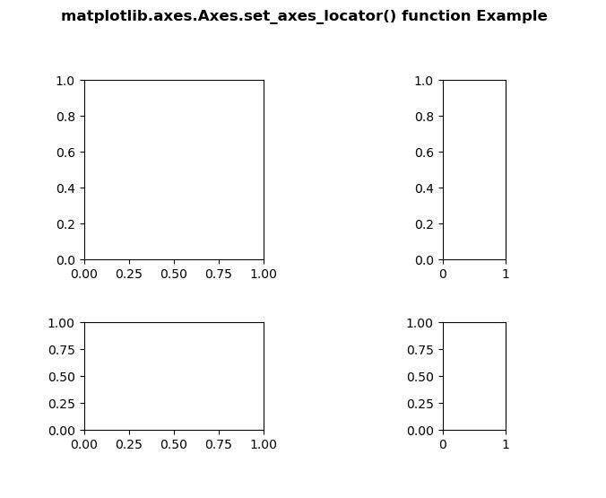
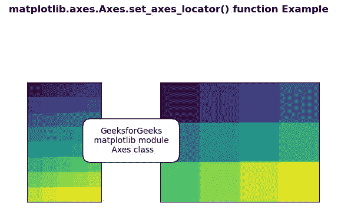

# Python 中的 matplotlib . axes . axes . set _ axes _ locator()

> 原文:[https://www . geeksforgeeks . org/matplotlib-axes-axes-set _ axes _ locator-in-python/](https://www.geeksforgeeks.org/matplotlib-axes-axes-set_axes_locator-in-python/)

**[Matplotlib](https://www.geeksforgeeks.org/python-introduction-matplotlib/)** 是 Python 中的一个库，是 NumPy 库的数值-数学扩展。**轴类**包含了大部分的图形元素:轴、刻度、线二维、文本、多边形等。，并设置坐标系。Axes 的实例通过回调属性支持回调。

## matplotlib . axes . axes . set _ axes _ locator()函数

matplotlib 库的 Axes 模块中的 **Axes.set_axes_locator()函数**用于设置轴定位器。

> **语法:** Axes.set_axes_locator(self，locator)
> 
> **参数:**该方法只接受一个参数。
> 
> *   **定位器**:该参数可通过类似–[[轴，渲染器]，Bbox]的值和语法调用。
> 
> **返回值:**此方法不返回值。

下面的例子说明了 matplotlib.axes . axes . set _ axes _ locator()函数在 matplotlib . axes 中的作用:

**例 1:**

```py
# Implementation of matplotlib function
from mpl_toolkits.axes_grid1 import Size, Divider
import matplotlib.pyplot as plt

fig = plt.figure(1, (6, 6))

value1 = [Size.Fixed(2.), Size.Fixed(.8), Size.Fixed(1.2),
         Size.Fixed(.7)]
value2 = [Size.Fixed(1.2), Size.Fixed(.7), Size.Fixed(2.)]

polygon = (0.2, 0.2, 0.4, 0.4)
resultant = Divider(fig, polygon, value1, 
                    value2, aspect = False)

ax1 = fig.add_axes(polygon, label ="2")
ax2 = fig.add_axes(polygon, label ="3")
ax3 = fig.add_axes(polygon, label ="1")
ax4 = fig.add_axes(polygon, label ="4")

ax1.set_axes_locator(resultant.new_locator(nx = 0,
                     ny = 0))
ax2.set_axes_locator(resultant.new_locator(nx = 0, 
                     ny = 2))
ax3.set_axes_locator(resultant.new_locator(nx = 3, 
                     ny = 2))
ax4.set_axes_locator(resultant.new_locator(nx = 3, 
                     nx1 = 4, ny = 0))

fig.suptitle('matplotlib.axes.Axes.set_axes_locator()\
 function Example\n\n', fontweight ="bold")
plt.show()
```

**输出:**


**例 2:**

```py
# Implementation of matplotlib function
import numpy as np
import matplotlib.pyplot as plt
from mpl_toolkits.axes_grid1.axes_divider import HBoxDivider
import mpl_toolkits.axes_grid1.axes_size as Size

arr1 = np.arange(40).reshape((8, 5))
arr2 = np.arange(12).reshape((3, 4))

fig, (ax1, ax2) = plt.subplots(1, 2)
ax1.imshow(arr1)
ax2.imshow(arr2)

rect = 111 
pad = 1
for ax in [ax1, ax2]:
    ax.locator_params(nbins = 1)
    ax.xaxis.set_visible(False)
    ax.yaxis.set_visible(False)

h1, v1 = Size.AxesX(ax1), Size.AxesY(ax1)
h2, v2 = Size.AxesX(ax2), Size.AxesY(ax2)

pad_v = Size.Scaled(1)
pad_h = Size.Fixed(pad)

my_divider = HBoxDivider(fig, rect,
                         horizontal =[h1, pad_h, h2],
                         vertical =[v1, pad_v, v2])

ax1.set_axes_locator(my_divider.new_locator(0))
ax2.set_axes_locator(my_divider.new_locator(2))

ax3 = plt.axes([0.4, 0.5, 0.001, 0.001], frameon = False)
ax3.xaxis.set_visible(False)
ax3.yaxis.set_visible(False)
ax3.annotate("GeeksforGeeks\n matplotlib module \n Axes class", 
             (1, 0.5),
             xycoords ="axes fraction",
             va ="center", ha ="center",
             bbox = dict(boxstyle ="round, 
             pad = 1", fc ="w"))

fig.suptitle('matplotlib.axes.Axes.set_axes_locator()\
 function Example\n\n', fontweight ="bold")
plt.show()
```

**输出:**
