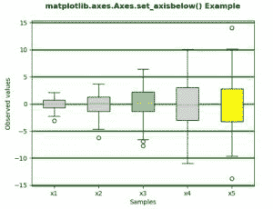
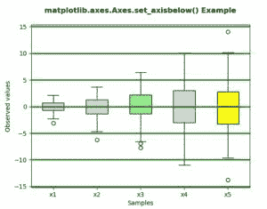

# Python 中的 matplotlib . axes . axes . set _ axis below()

> 原文:[https://www . geeksforgeeks . org/matplotlib-axes-axes-set _ axis below-in-python/](https://www.geeksforgeeks.org/matplotlib-axes-axes-set_axisbelow-in-python/)

**[Matplotlib](https://www.geeksforgeeks.org/python-introduction-matplotlib/)** 是 Python 中的一个库，是 NumPy 库的数值-数学扩展。**轴类**包含了大部分的图形元素:轴、刻度、线二维、文本、多边形等。，并设置坐标系。Axes 的实例通过回调属性支持回调。

## matplotlib . axes . axes . set _ axis below()函数

matplotlib 库的 Axes 模块中的 **Axes.set_axisbelow()函数**用于设置轴刻度和网格线是在大多数美工的上方还是下方。

> **语法:** Axes.set_axisbelow(self，b)
> 
> **参数:**该方法只接受一个参数。
> 
> *   **b:** This parameter contains a boolean value and it’s possible values are : True, False or “line”.
>     
>     **返回:**这个方法不返回任何东西。

下面的例子说明了 matplotlib.axes . axes . set _ axis below()函数在 matplotlib . axes 中的作用:

**例 1:**

```
# Implementation of matplotlib function
import matplotlib.pyplot as plt
import numpy as np

# Random test data
np.random.seed(19680801)
all_data = [np.random.normal(0, std, size = 100) for std in range(1, 6)]
labels = ['x1', 'x2', 'x3', 'x4', 'x5']

fig, ax = plt.subplots()

bplot = ax.boxplot(all_data,
                     vert = True,  
                     patch_artist = True,  
                     labels = labels) 
colors = ['lightpink', 'lightblue', 'lightgreen',
          "lightgrey", "yellow"]
for patch, color in zip(bplot['boxes'], colors):
    patch.set_facecolor(color)

ax.yaxis.grid(True, color ="green", lw = 2)
ax.set_axisbelow(True)
ax.set_xlabel('Samples')
ax.set_ylabel('Observed values')
ax.set_title('matplotlib.axes.Axes.set_axisbelow() \
Example\n', fontsize = 12, fontweight ='bold')
plt.show()
```

**输出:**


**例 2:**

```
# Implementation of matplotlib function
import matplotlib.pyplot as plt
import numpy as np

# Random test data
np.random.seed(19680801)
all_data = [np.random.normal(0, std, size = 100) for std in range(1, 6)]
labels = ['x1', 'x2', 'x3', 'x4', 'x5']

fig, ax = plt.subplots()

bplot = ax.boxplot(all_data,
                     vert = True,  
                     patch_artist = True,  
                     labels = labels) 
colors = ['lightpink', 'lightblue', 'lightgreen',
          "lightgrey", "yellow"]
for patch, color in zip(bplot['boxes'], colors):
    patch.set_facecolor(color)

ax.yaxis.grid(True, color ="green", lw = 2)
ax.set_axisbelow(False)
ax.set_xlabel('Samples')
ax.set_ylabel('Observed values')
ax.set_title('matplotlib.axes.Axes.set_axisbelow()\
 Example\n', fontsize = 12, fontweight ='bold')
plt.show()
```

**输出:**
