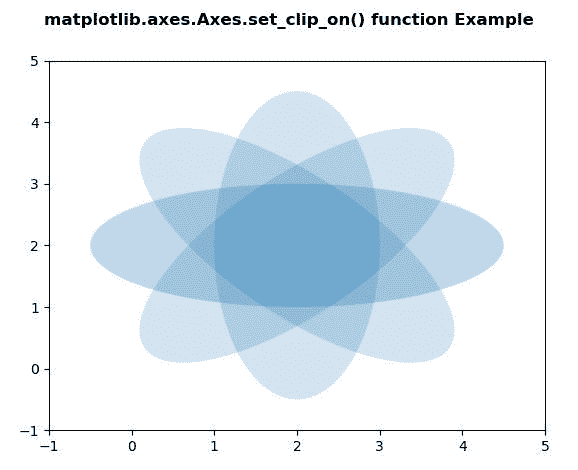
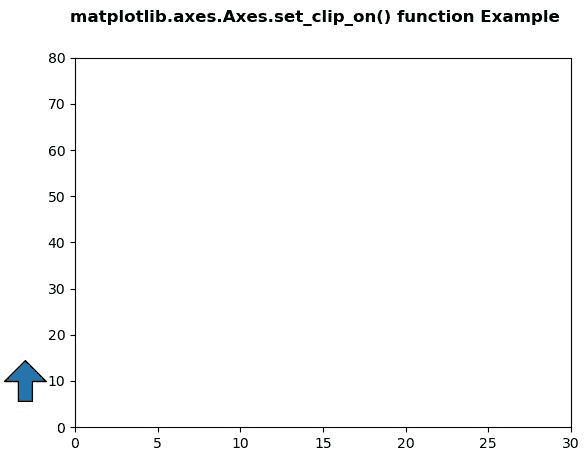

# Python 中的 matplotlib . axes . axes . set _ clip _ on()

> 原文:[https://www . geeksforgeeks . org/matplotlib-axes-axes-set _ clip _ on-in-python/](https://www.geeksforgeeks.org/matplotlib-axes-axes-set_clip_on-in-python/)

**[Matplotlib](https://www.geeksforgeeks.org/python-introduction-matplotlib/)** 是 Python 中的一个库，是 NumPy 库的数值-数学扩展。**轴类**包含了大部分的图形元素:轴、刻度、线二维、文本、多边形等。，并设置坐标系。Axes 的实例通过回调属性支持回调。

## matplotlib . axes . axes . set _ clip _ on()函数

matplotlib 库的 Axes 模块中的 **Axes.set_clip_on()函数**用于设置艺术家是否使用剪裁。

> **语法:** Axes.set_clip_on(self，b)
> 
> **参数:**该方法只接受一个参数。
> 
> *   **b:** 该参数包含布尔值。
> 
> **返回:**该方法不返回值。

下面的例子说明了 matplotlib.axes . axes . set _ clip _ on()函数在 matplotlib . axes 中的作用:

**例 1:**

```
# Implementation of matplotlib function
import matplotlib.pyplot as plt
import numpy as np
from matplotlib.patches import Ellipse

delta = 45.0

angles = np.arange(0, 360 + delta, delta)
ells = [Ellipse((2, 2), 5, 2, a) for a in angles]

fig, ax = plt.subplots()

for e in ells:
    e.set_alpha(0.1)
    ax.add_artist(e)

ax.set_xlim(-1, 5)
ax.set_ylim(-1, 5)
ax.set_clip_on(False)

fig.suptitle('matplotlib.axes.Axes.set_clip_on()\
 function Example\n\n', fontweight ="bold")

plt.show()
```

**输出:**


**例 2:**

```
# Implementation of matplotlib function
import matplotlib.pyplot as plt
import matplotlib.patches as mpatches
import matplotlib.transforms as mtransforms

x0 = -0.1

arrow_style ="simple, head_length = 15,\
 head_width = 30, tail_width = 10"
rect_style ="simple, tail_width = 25"
line_style ="simple, tail_width = 1"

fig, ax = plt.subplots()

trans = mtransforms.blended_transform_factory(ax.transAxes, ax.transData)

y_tail = 5
y_head = 15
arrow1 = mpatches.FancyArrowPatch((x0, y_tail), 
                                  (x0, y_head),
                                   arrowstyle = arrow_style,
                                   transform = trans)
arrow1.set_clip_on(False)
ax.add_patch(arrow1)

ax.set_xlim(0, 30)
ax.set_ylim(0, 80)

fig.suptitle('matplotlib.axes.Axes.set_clip_on() \
function Example\n\n', fontweight ="bold")

plt.show()
```

**输出:**
