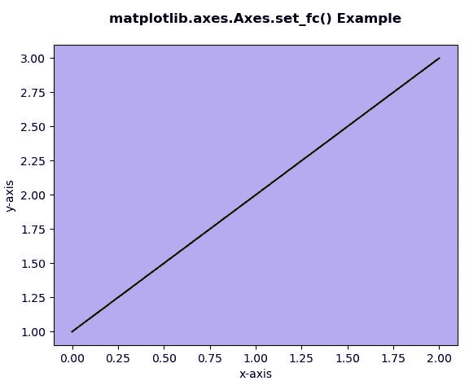

# matplotlib . axes . set _ fc()用 Python

表示

> 哎哎哎:# t0]https://www . geeksforgeeks . org/matplot lib-axes-set _ fc-in-python/

**[Matplotlib](https://www.geeksforgeeks.org/python-introduction-matplotlib/)** 是 Python 中的一个库，是 NumPy 库的数值-数学扩展。**轴类**包含了大部分的图形元素:轴、刻度、线二维、文本、多边形等。，并设置坐标系。Axes 的实例通过回调属性支持回调。

## matplotlib.axes.Axes.set_fc()函数

matplotlib 库的 axes 模块中的 **Axes.set_fc()函数**用于设置 Axes 的面颜色。

> **语法:** Axes.set_fc(self，color)
> 
> **参数:**该方法只接受一个参数。
> **颜色:**此参数接受轴的面颜色。
> 
> **返回:**此方法不返回任何值。

下面的例子说明了 matplotlib.axes.Axes.set_fc()函数在 matplotlib.axes 中的作用:

**例 1:**

```
# Implementation of matplotlib function 
import matplotlib.pyplot as plt
import numpy as np

fig, ax = plt.subplots()

ax.set_fc('# B6ABF0')
ax.set_xlabel('x-axis')
ax.set_ylabel('y-axis')
ax.plot([1, 2, 3], color ="black")

ax.set_title('matplotlib.axes.Axes.set_fc()\
 Example\n', fontsize = 12, fontweight ='bold')
plt.show()
```

**输出:**


**例 2:**

```
# Implementation of matplotlib function
import numpy as np
import matplotlib.pyplot as plt

t = np.linspace(0.0, 2.0, 201)
s = np.sin(2 * np.pi * t)

fig, ax = plt.subplots()
ax.set_fc('# 339E17')
ax.set_xlabel('x-axis')
ax.set_ylabel('y-axis')
ax.plot(t, s, )
ax.set_title('matplotlib.axes.Axes.set_fc()\
 Example\n', fontsize = 12, fontweight ='bold')
plt.show()
```

**输出:**
