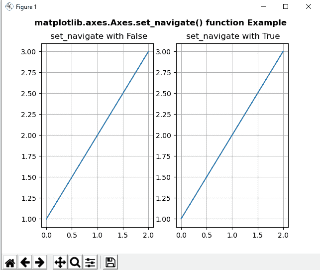

# Python 中的 matplotlib . axes . axes . set _ navigate()

> 原文:[https://www . geeksforgeeks . org/matplotlib-axes-axes-set _ navive-in-python/](https://www.geeksforgeeks.org/matplotlib-axes-axes-set_navigate-in-python/)

**[Matplotlib](https://www.geeksforgeeks.org/python-introduction-matplotlib/)** 是 Python 中的一个库，是 NumPy 库的数值-数学扩展。**轴类**包含了大部分的图形元素:轴、刻度、线二维、文本、多边形等。，并设置坐标系。Axes 的实例通过回调属性支持回调。

## matplotlib . axes . axes . set _ navigate()函数

matplotlib 库的 Axes 模块中的**axes . set _ navive()函数**用于检查轴是否响应导航工具栏命令。

> **语法:** Axes.set_navigate(self，b)
> 
> **参数:**这接受下面描述的以下参数:
> 
> *   **b :** 该参数包含布尔值。
> 
> **返回值:**此方法不返回值。

以下示例说明了 matplotlib . axes . axes . set _ navigate()函数在 matplotlib.axes:
**示例 1:**

```py
# Implementation of matplotlib function
import matplotlib.pyplot as plt
from mpl_toolkits.axisartist.axislines import SubplotZero
import numpy as np

fig, ax = plt.subplots()

xx = np.arange(0, 2 * np.pi, 0.01)
ax.plot(xx, np.sin(xx))
ax.set_navigate(False)

fig.suptitle('matplotlib.axes.Axes.set_navigate() function\
 Example\n\n', fontweight ="bold")

plt.show()
```

**输出:**


**例 2:**

```py
# Implementation of matplotlib function
import matplotlib.pyplot as plt
import numpy as np

fig, (ax, ax1)= plt.subplots(1, 2)

ax.plot([1, 2, 3])
ax.grid()

ax1.plot([1, 2, 3])
ax1.grid()

ax.set_navigate(False)
ax1.set_navigate(True)

ax.set_title(" set_navigate with False")
ax1.set_title(" set_navigate with True")

fig.suptitle('matplotlib.axes.Axes.set_navigate() function\
 Example\n\n', fontweight ="bold")

plt.show()
```

**输出:**
**在轴 1 上移动光标:**

**在轴 2 上移动光标:**
