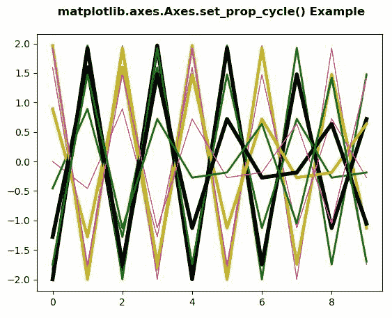
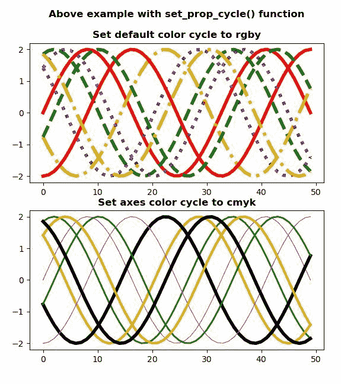

# Python 中的 matplotlib . axes . axes . set _ prop _ cycle()

> 原文:[https://www . geeksforgeeks . org/matplotlib-axes-axes-set _ prop _ cycle-in-python/](https://www.geeksforgeeks.org/matplotlib-axes-axes-set_prop_cycle-in-python/)

**[Matplotlib](https://www.geeksforgeeks.org/python-introduction-matplotlib/)** 是 Python 中的一个库，是 NumPy 库的数值-数学扩展。**轴类**包含了大部分的图形元素:轴、刻度、线二维、文本、多边形等。，并设置坐标系。Axes 的实例通过回调属性支持回调。

## matplotlib . axes . axes . set _ prop _ cycle()函数

matplotlib 库的 axes 模块中的 **Axes.set_prop_cycle()函数**用于设置 Axes 的属性循环。

> **语法:** Axes.set_prop_cycle(self，*args，**kwargs)
> 
> **参数:**该方法接受以下参数。
> 
> *   **循环仪:**该参数用于设置给定的循环仪。
> *   **标签:**此参数为属性键。
> *   **值:**该参数是属性值的有限长度可迭代。
> 
> **返回:**该方法不返回任何值。

下面的例子说明了 matplotlib.axes . axes . set _ prop _ cycle()函数在 matplotlib . axes 中的作用:

**例 1:**

```
# Implementation of matplotlib function
from cycler import cycler
import numpy as np
import matplotlib.pyplot as plt

x = np.linspace(0, 200, 10)

yy = np.transpose([2 * np.sin(x + phi) for phi in x])

fig, ax1 = plt.subplots()

ax1.set_prop_cycle(color =['magenta', 'g',
                           'y', 'k'],
                   lw =[1, 2, 3, 4])
ax1.plot(yy)
ax1.set_title(' matplotlib.axes.Axes.set_prop_cycle() \
Example\n', fontsize = 12, fontweight ='bold')
plt.show()
```

**输出:**


**例 2:**

```
# Implementation of matplotlib function
from cycler import cycler
import numpy as np
import matplotlib.pyplot as plt

x = np.linspace(0, 3 * np.pi)

offsets = np.linspace(0, 3 * np.pi, 8, 
                      endpoint = False)

yy = np.transpose([2 * np.sin(x + phi) for phi in offsets])

plt.rc('lines', linewidth = 4)
plt.rc('axes', prop_cycle =(cycler(color =['r', 'g',
                                           'purple',
                                           'orange']) +
                           cycler(linestyle =['-', 
                                              '--',
                                              ':',
                                              '-.'])))

fig, (ax0, ax1) = plt.subplots(nrows = 2)
ax0.plot(yy)
ax0.set_title('Above example with set_prop_cycle() \
function\n\nSet default color cycle to rgby',
              fontsize = 12, fontweight ='bold')

ax1.set_prop_cycle(color =['magenta', 'g', 
                           'y', 'k'],
                   lw =[1, 2, 3, 4])
ax1.plot(yy)
ax1.set_title('Set axes color cycle to cmyk',
              fontsize = 12, 
              fontweight ='bold')

plt.show()
```

**输出:**
