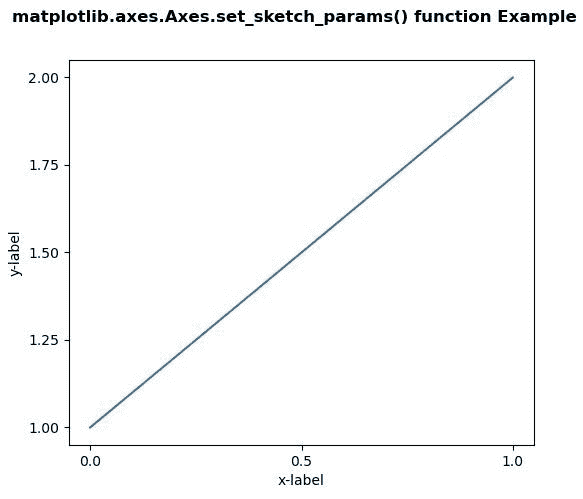
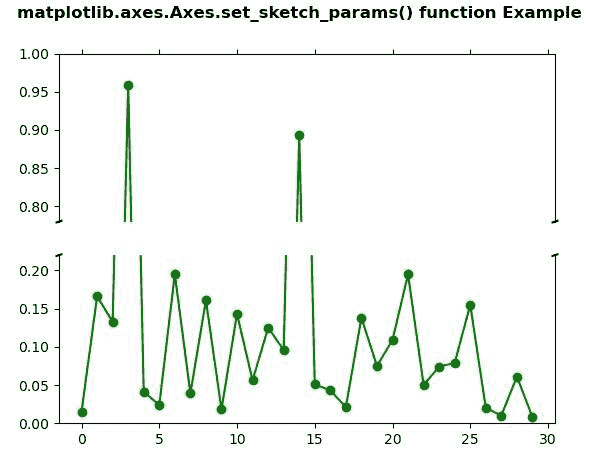

# Python 中的 matplotlib . axes . axes . set _ sketch _ params()

> 原文:[https://www . geeksforgeeks . org/matplotlib-axes-axes-set _ sketch _ params-in-python/](https://www.geeksforgeeks.org/matplotlib-axes-axes-set_sketch_params-in-python/)

**[Matplotlib](https://www.geeksforgeeks.org/python-introduction-matplotlib/)** 是 Python 中的一个库，是 NumPy 库的数值-数学扩展。**轴类**包含了大部分的图形元素:轴、刻度、线二维、文本、多边形等。，并设置坐标系。Axes 的实例通过回调属性支持回调。

## matplotlib . axes . axes . set _ sketch _ params()函数

matplotlib 库的 Axes 模块中的 **Axes.set_sketch_params()函数**用于设置草图参数。

> **语法:** Axes.set_sketch_params(self，scale=None，length=None，随机性=None)
> 
> **参数:**该方法只接受三个参数。
> 
> *   **比例:**此参数是垂直于源线的摆动幅度，以像素为单位。
> *   **长度:**此参数是沿直线摆动的长度，以像素为单位。
> *   **随机性:**该参数是长度缩小或扩大的比例因子。
> 
> **返回:**该方法不返回值。

下面的例子说明了 matplotlib.axes . axes . set _ sketch _ params()函数在 matplotlib . axes 中的作用:

**例 1:**

```
# Implementation of matplotlib function
import matplotlib.pyplot as plt
import matplotlib.colors as mcolors
import matplotlib.gridspec as gridspec
import numpy as np

plt.rcParams['savefig.facecolor'] = "0.8"
plt.rcParams['figure.figsize'] = 6, 5

fig, ax = plt.subplots()

ax.plot([1, 2])

ax.locator_params("x", nbins = 3)
ax.locator_params("y", nbins = 5)

ax.set_xlabel('x-label')
ax.set_ylabel('y-label')

ax.set_sketch_params(100, 100, 20)

fig.suptitle('matplotlib.axes.Axes.set_sketch_params() \
function Example\n\n', fontweight ="bold")

plt.show()
```

**输出:**


**例 2:**

```
# Implementation of matplotlib function
import matplotlib.pyplot as plt
import numpy as np

values = np.array([
    0.015, 0.166, 0.133, 
    0.159, 0.041, 0.024,
    0.195, 0.039, 0.161,
    0.018, 0.143, 0.056,
    0.125, 0.096, 0.094,
    0.051, 0.043, 0.021,
    0.138, 0.075, 0.109,
    0.195, 0.050, 0.074, 
    0.079, 0.155, 0.020,
    0.010, 0.061, 0.008])

values[[3, 14]] += .8

fig, (ax, ax2) = plt.subplots(2, 1, sharex = True)

ax.plot(values, "o-", color ="green")
ax2.plot(values, "o-", color ="green")

ax.set_ylim(.78, 1.) 
ax2.set_ylim(0, .22)

ax.spines['bottom'].set_visible(False)
ax2.spines['top'].set_visible(False)
ax.xaxis.tick_top()
ax.tick_params(labeltop = False)
ax2.xaxis.tick_bottom()

d = .005
kwargs = dict(transform = ax.transAxes, 
              color ='k', clip_on = False)

ax.plot((-d, +d), (-d, +d), **kwargs)       
ax.plot((1 - d, 1 + d), (-d, +d), **kwargs) 

kwargs.update(transform = ax2.transAxes)  

ax2.plot((-d, +d), (1 - d, 1 + d), **kwargs)
ax2.plot((1 - d, 1 + d), (1 - d, 1 + d), **kwargs) 

ax.set_sketch_params(1.0, 100.0, 22.0)
ax2.set_sketch_params(1.0, 100.0, 22.0)  

fig.suptitle('matplotlib.axes.Axes.set_sketch_params() \
function Example\n\n', fontweight ="bold")

plt.show()
```

**输出:**
