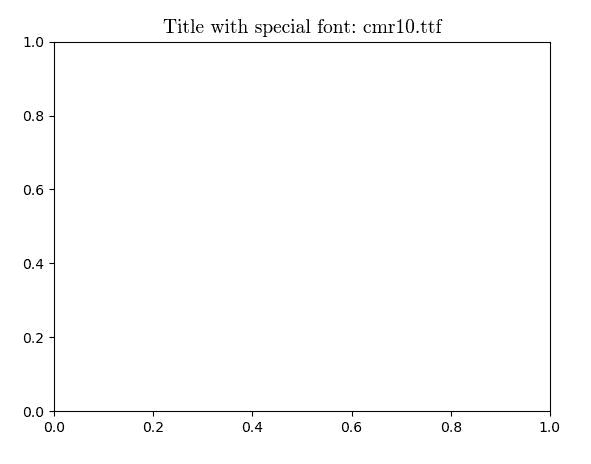

# Python 中的 Matplotlib.axes.Axes.set_title()

> 原文:[https://www . geeksforgeeks . org/matplotlib-axes-axes-set _ title-in-python/](https://www.geeksforgeeks.org/matplotlib-axes-axes-set_title-in-python/)

**[Matplotlib](https://www.geeksforgeeks.org/python-introduction-matplotlib/)** 是 Python 中的一个库，是 NumPy 库的数值-数学扩展。**轴类**包含了大部分的图形元素:轴、刻度、线二维、文本、多边形等。，并设置坐标系。Axes 的实例通过回调属性支持回调。

## matplotlib.axes.Axes.set_title()函数

matplotlib 库的 Axes 模块中的 **Axes.set_title()函数**用于设置轴的标题。

> **语法:** Axes.set_title(self，label，fontdict=None，loc='center '，pad=None，**kwargs)
> 
> **参数:**该方法接受以下参数。
> 
> *   **标签:**此参数是标题使用的文本。
> *   **fontdict :** 此参数是控制标题文本外观的字典。
> *   **loc :** 此参数用于设置标题的位置{ '中央'，'左'，'右' }。
> *   **pad :** 此参数是标题相对于轴顶部的偏移量，以磅为单位。
> 
> **返回:**该方法返回表示标题的 matplotlib 文本实例。

下面的例子说明了 matplotlib.axes.Axes.set_title()函数在 matplotlib.axes 中的作用:

**例 1:**

```py
# Implementation of matplotlib function
import os
from matplotlib import font_manager as fm, rcParams
import matplotlib.pyplot as plt

fig, ax = plt.subplots()

fpath = os.path.join(rcParams["datapath"], 
                     "fonts/ttf/cmr10.ttf")

prop = fm.FontProperties(fname = fpath)
fname = os.path.split(fpath)[1]
ax.set_title('Title with special font: {}'.format(fname),
             fontproperties = prop, 
             fontsize = 14)

plt.show()
```

**输出:**


**例 2:**

```py
# Implementation of matplotlib function
import numpy as np
import matplotlib.pyplot as plt

x = np.arange(0.1, 5, 0.1)
y = np.exp(-x)

yerr = 0.1 + 0.1 * np.sqrt(x)

fig, axs = plt.subplots(nrows = 1,
                        ncols = 2, 
                        sharex = True)
ax = axs[0]
ax.errorbar(x, y, yerr = yerr, 
            color ="green")
ax.set_title('Title of Axes 1', 
             fontweight ="bold")

ax = axs[1]
ax.errorbar(x, y, yerr = yerr,
            errorevery = 5, 
            color ="green")

ax.set_title('Title of Axes 2',
             fontweight ="bold")

fig.suptitle('matplotlib.axes.Axes.set_title() \
function Example\n')

plt.show()
```

**输出:**
