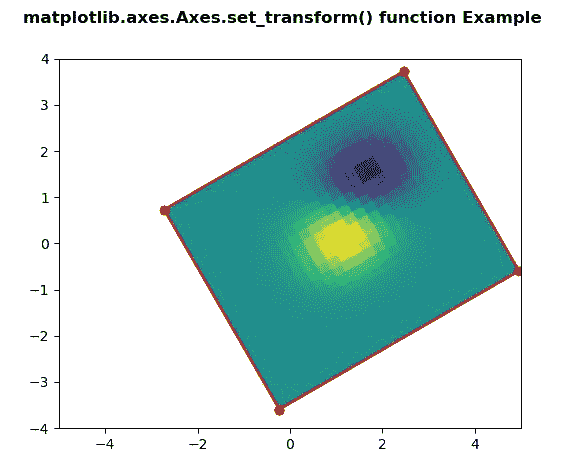
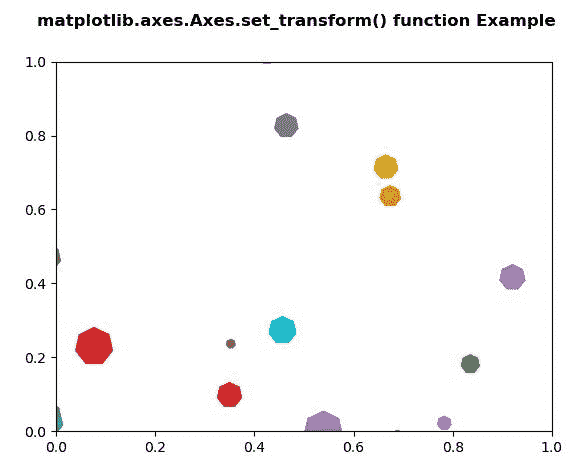

# Python 中的 matplotlib . axes . axes . set _ transform()

> 原文:[https://www . geeksforgeeks . org/matplotlib-axes-axes-set _ transform-in-python/](https://www.geeksforgeeks.org/matplotlib-axes-axes-set_transform-in-python/)

**[Matplotlib](https://www.geeksforgeeks.org/python-introduction-matplotlib/)** 是 Python 中的一个库，是 NumPy 库的数值-数学扩展。**轴类**包含了大部分的图形元素:轴、刻度、线二维、文本、多边形等。，并设置坐标系。Axes 的实例通过回调属性支持回调。

## matplotlib . axes . axes . set _ transform()函数

matplotlib 库的 Axes 模块中的 **Axes.set_transform()函数**用于设置艺术家变换。

> **语法:** Axes.set_transform(self，t)
> 
> **参数:**该方法只接受一个参数。
> 
> *   **t :** 此参数为变换。
> 
> **返回:**该方法不返回值。

下面的例子说明了 matplotlib.axes . axes . set _ transform()函数在 matplotlib . axes 中的作用:

**例 1:**

```py
# Implementation of matplotlib function
import numpy as np
import matplotlib.pyplot as plt
import matplotlib.transforms as mtransforms

delta = 0.25
x = y = np.arange(-3.0, 3.0, delta)
X, Y = np.meshgrid(x, y)
Z1 = np.exp(-X**2 - Y**2)
Z2 = np.exp(-(X - 1)**2 - (Y - 1)**2)
Z = (Z1 - Z2)

transform = mtransforms.Affine2D().rotate_deg(30)
fig, ax = plt.subplots()

im = ax.imshow(Z, interpolation ='none',
               origin ='lower',
               extent =[-2, 4, -3, 2], 
               clip_on = True)

trans_data = transform + ax.transData
im.set_transform(trans_data)

x1, x2, y1, y2 = im.get_extent()
ax.plot([x1, x2, x2, x1, x1], 
        [y1, y1, y2, y2, y1],
        "ro-",
        transform = trans_data)

ax.set_xlim(-5, 5)
ax.set_ylim(-4, 4)

fig.suptitle('matplotlib.axes.Axes.set_transform() \
function Example\n\n', fontweight ="bold")

plt.show()
```

**输出:**


**例 2:**

```py
# Implementation of matplotlib function  
import matplotlib.pyplot as plt
from matplotlib import collections, colors, transforms
import numpy as np

nverts = 50
npts = 100

r = np.arange(nverts)
theta = np.linspace(0, 2 * np.pi, nverts)
xx = r * np.sin(theta)
yy = r * np.cos(theta)
spiral = np.column_stack([xx, yy])

rs = np.random.RandomState(19680801)

xyo = rs.randn(npts, 2)

colors = [colors.to_rgba(c)
          for c in plt.rcParams['axes.prop_cycle'].by_key()['color']]

fig, ax1 = plt.subplots()

col = collections.RegularPolyCollection(
    7, sizes = np.abs(xx) * 10.0, 
    offsets = xyo, 
    transOffset = ax1.transData)

trans = transforms.Affine2D().scale(fig.dpi / 72.0)
col.set_transform(trans) 

ax1.add_collection(col, autolim = True)
col.set_color(colors)

fig.suptitle('matplotlib.axes.Axes.set_transform() function\
 Example\n', fontweight ="bold")

fig.canvas.draw()

plt.show()
```

**输出:**
