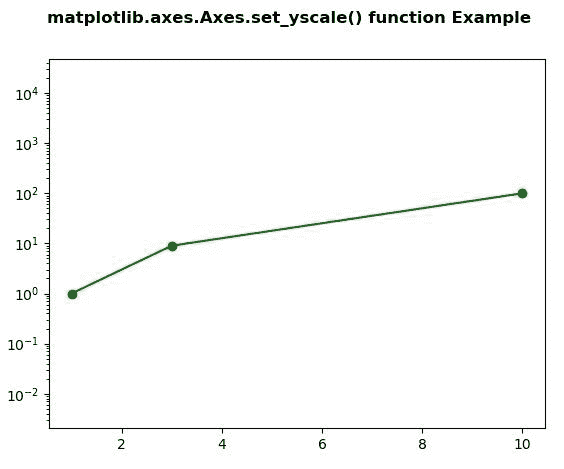
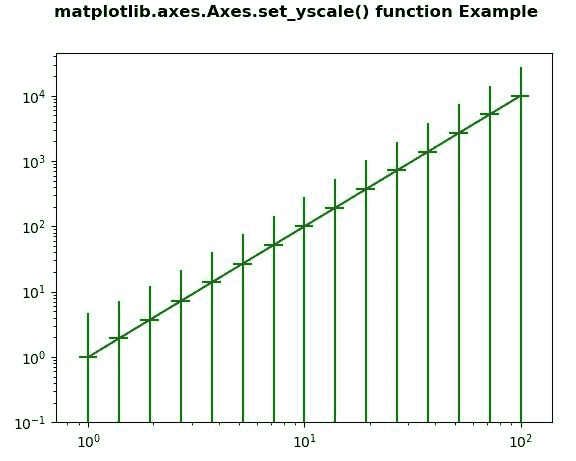

# Python 中的 matplotlib . axes . axes . set _ yscale()

> 原文:[https://www . geeksforgeeks . org/matplotlib-axes-axes-set _ yscale-in-python/](https://www.geeksforgeeks.org/matplotlib-axes-axes-set_yscale-in-python/)

**[Matplotlib](https://www.geeksforgeeks.org/python-introduction-matplotlib/)** 是 Python 中的一个库，是 NumPy 库的数值-数学扩展。**轴类**包含了大部分的图形元素:轴、刻度、线二维、文本、多边形等。，并设置坐标系。Axes 的实例通过回调属性支持回调。

## matplotlib . axes . axes . set _ yscale()函数

matplotlib 库的 Axes 模块中的 **Axes.set_yscale()函数**用于设置 y 轴比例。

> **语法:** Axes.set_xscale(self，value，**kwargs)
> 
> **参数:**该方法接受以下参数。
> 
> *   **值:**此参数是要应用的轴比例类型。
> *   ****kwargs:** 有不同的关键字参数被接受，其取决于规模。

下面的例子说明了 matplotlib.axes . axes . set _ yscale()函数在 matplotlib . axes 中的作用:

**例 1:**

```py
# Implementation of matplotlib function
import matplotlib.pyplot as plt

fig, ax = plt.subplots()

ax.set_yscale("log")
ax.set_adjustable("datalim")
ax.plot([1, 3, 10], [1, 9, 100], "o-",
        color ="green")

ax.set_ylim(1e-1, 1e3)
ax.set_aspect(1)
fig.suptitle('matplotlib.axes.Axes.set_yscale()\
 function Example\n', fontweight ="bold")
plt.show()
```

**输出:**


**例 2:**

```py
# Implementation of matplotlib function
import numpy as np
import matplotlib.pyplot as plt

fig, ax4 = plt.subplots()

x = 10.0**np.linspace(0.0, 2.0, 15)
y = x**2.0
ax4.set_xscale("log", nonposx ='clip')
ax4.set_yscale("log", nonposy ='clip')

ax4.errorbar(x, y, xerr = 0.1 * x,
             yerr = 2.0 + 1.75 * y,
             color ="green")

ax4.set_ylim(bottom = 0.1)

fig.suptitle('matplotlib.axes.Axes.set_yscale() \
function Example\n', fontweight ="bold")

plt.show()
```

**输出:**
