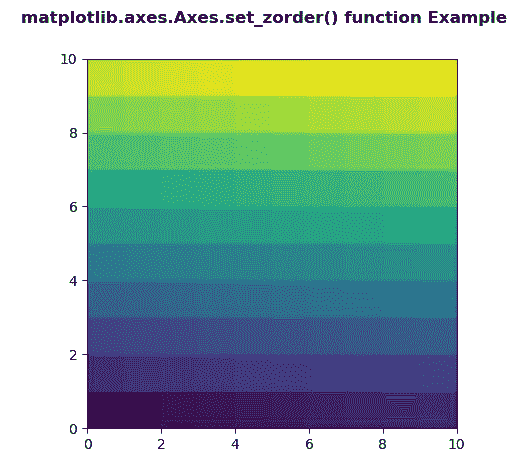
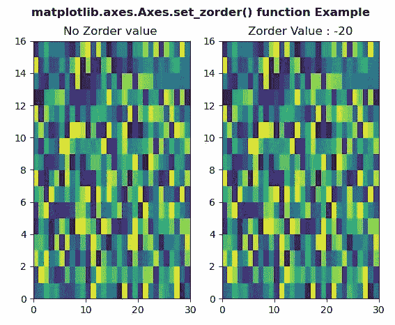

# Python 中的 matplotlib . axes . axes . set _ zorder()

> 原文:[https://www . geeksforgeeks . org/matplotlib-axes-axes-set _ zorder-in-python/](https://www.geeksforgeeks.org/matplotlib-axes-axes-set_zorder-in-python/)

**[Matplotlib](https://www.geeksforgeeks.org/python-introduction-matplotlib/)** 是 Python 中的一个库，是 NumPy 库的数值-数学扩展。**轴类**包含了大部分的图形元素:轴、刻度、线二维、文本、多边形等。，并设置坐标系。Axes 的实例通过回调属性支持回调。

## matplotlib . axes . axes . set _ zorder()函数

matplotlib 库的 Axes 模块中的 **Axes.set_zorder()函数**用于为艺术家设置 zorder。

> **语法:** Axes.set_zorder(self，level)
> 
> **参数:**该方法只接受一个参数。
> 
> *   **级别:**该参数包含浮点值。
> 
> **返回:**该方法不返回值。

下面的例子说明了 matplotlib.axes . axes . set _ zorder()函数在 matplotlib . axes 中的作用:

**例 1:**

```
# Implementation of matplotlib function
import numpy as np
import matplotlib.pyplot as plt

d = np.arange(100).reshape(10, 10)
xx, yy = np.meshgrid(np.arange(11), np.arange(11))

fig, ax = plt.subplots()

ax.set_aspect(1)
m = ax.pcolormesh(xx, yy, d)
m.set_zorder(-15)

fig.suptitle('matplotlib.axes.Axes.set_zorder() function\
 Example', fontweight ="bold")

plt.show()
```

**输出:**


**示例-2:**

```
# Implementation of matplotlib function
import numpy as np
import matplotlib.pyplot as plt

xx = np.random.rand(16, 30)

fig, (ax3, ax4) = plt.subplots(1, 2)

m = ax3.pcolor(xx)

ax3.set_title("No Zorder value ")

m = ax4.pcolor(xx)
m.set_zorder(-20)

ax4.set_title("Zorder Value : -20")

fig.suptitle('matplotlib.axes.Axes.set_zorder() \
function Example', fontweight ="bold")

plt.show()
```

**输出:**
