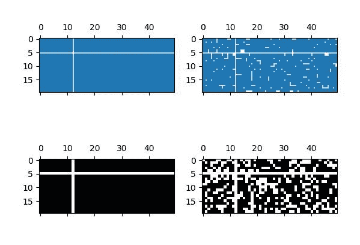

# Python 中的 Matplotlib.axes.Axes.spy()

> 原文:[https://www . geesforgeks . org/matplotlib-axes-axes-python 中的间谍/](https://www.geeksforgeeks.org/matplotlib-axes-axes-spy-in-python/)

**[Matplotlib](https://www.geeksforgeeks.org/python-introduction-matplotlib/)** 是 Python 中的一个库，是 NumPy 库的数值-数学扩展。**轴类**包含了大部分的图形元素:轴、刻度、线二维、文本、多边形等。，并设置坐标系。Axes 的实例通过回调属性支持回调。

## matplotlib.axes.Axes.spy()函数

matplotlib 库中 Axes 模块中的 **Axes.spy()函数**也用于绘制 2D 阵列的稀疏模式。它还用于可视化数组的非零值。

> **语法:** Axes.spy(self，Z，precision=0，marker=None，markersize=None，aspect='equal '，origin='upper '，**kwargs
> 
> **参数:**该方法接受以下描述的参数:
> 
> *   **Z :** 此参数是要绘制的数组。
> *   **精度:**此参数用于确定是否要绘制任何非零值。
> *   **原点:**该参数将数组的[0，0]索引放在轴的左上角或左下角。
> *   **纵横比:**该参数为可选参数，用于控制轴的纵横比。
> 
> **返回:**这将返回以下内容:
> 
> *   **ret:** 这将返回**axe image**或 **Line2D** 。这取决于绘图风格

下面的例子说明了 matplotlib.axes.Axes.spy()函数在 matplotlib.axes 中的作用:

**示例-1:**

```py
# Implementation of matplotlib function
import matplotlib.pyplot as plt
import numpy as np

fig, ax1 = plt.subplots()

x = np.random.randn(20, 50)
x[12, :] = 0.
x[:, 22] = 0.
ax1.spy(x)

plt.show()
ax1.set_title('matplotlib.axes.Axes.spy() Example')
plt.show()
```

**输出:**


**示例-2:**

```py
# Implementation of matplotlib function
import matplotlib.pyplot as plt
import numpy as np

fig, [(ax1, ax2), (ax3, ax4)] = plt.subplots(2, 2)

x = np.random.randn(20, 50)
x[5, :] = 0.
x[:, 12] = 0.

ax1.spy(x, markersize = 4)
ax2.spy(x, precision = 0.2, markersize = 4)

ax3.spy(x)
ax4.spy(x, precision = 0.4)

plt.show()
ax1.set_title('matplotlib.axes.Axes.spy() Example')
plt.show()
```

**输出:**
