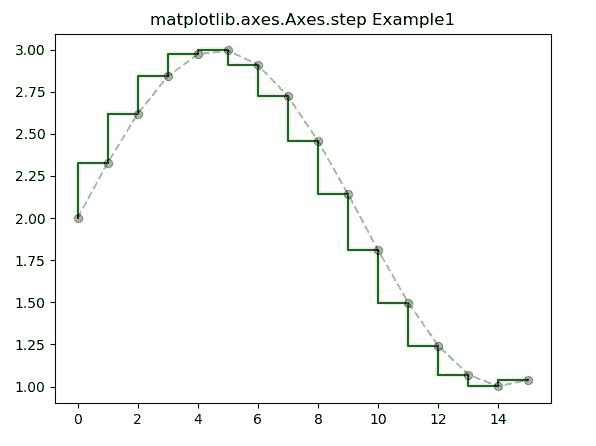
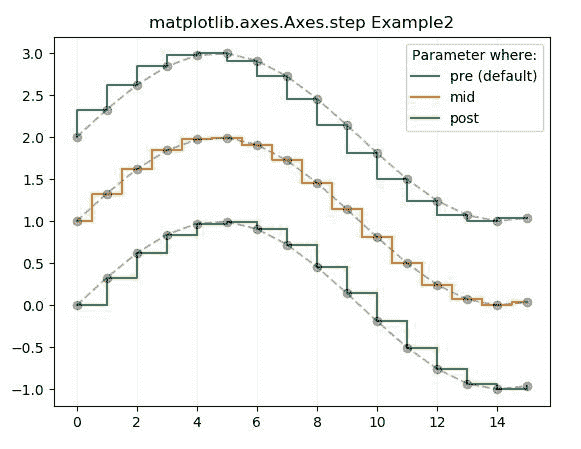

# Python 中的 matplotlib.axes.Axes.step()

> 原文:[https://www . geeksforgeeks . org/matplotlib-axes-axes-step-in-python/](https://www.geeksforgeeks.org/matplotlib-axes-axes-step-in-python/)

**[Matplotlib](https://www.geeksforgeeks.org/python-introduction-matplotlib/)** 是 Python 中的一个库，是 NumPy 库的数值-数学扩展。**轴类**包含了大部分的图形元素:轴、刻度、线二维、文本、多边形等。，并设置坐标系。Axes 的实例通过回调属性支持回调。

## matplotlib.axes.Axes.step()函数

matplotlib 库的 Axes 模块中的 **Axes.errorbar()函数**用于制作阶梯图..

> **语法:**
> 
> ```
> Axes.step(self, x, y, *args, where='pre', data=None, **kwargs)
> ```
> 
> **参数:**该方法接受以下描述的参数:
> 
> *   **x，y:** 这些参数是数据点的水平和垂直坐标。
> *   **fmt:** 该参数为可选参数，包含字符串值。
> *   **数据:**该参数也是可选参数。它是带有标签数据的对象。
> *   **其中:**该参数也是可选参数。它用来定义步骤应该放在哪里。数值为 *{ '前'，'后'，'中' }* 。 *pre* 为默认值
> 
> **返回:**这将返回以下内容:
> 
> *   **线:**这将返回表示打印数据的线 2D 对象列表。

下面的例子说明了 matplotlib.axes.Axes.step()函数在 matplotlib.axes 中的作用:

**示例-1:**

```
# Implementation of matplotlib function

import numpy as np
import matplotlib.pyplot as plt

x = np.arange(16)
y = np.sin(x / 3)

fig, ax = plt.subplots()

ax.step(x, y + 2, color ='green')
ax.plot(x, y + 2, 'o--', color ='black', alpha = 0.3)

ax.set_title('matplotlib.axes.Axes.step Example1')
plt.show()
```

**输出:**


**示例-2:**

```
# Implementation of matplotlib function

import numpy as np
import matplotlib.pyplot as plt

x = np.arange(16)
y = np.sin(x / 3)

fig, ax = plt.subplots()

ax.step(x, y + 2, label ='pre (default)')
ax.plot(x, y + 2, 'o--', color ='black', alpha = 0.3)

ax.step(x, y + 1, where ='mid', label ='mid')
ax.plot(x, y + 1, 'o--', color ='black', alpha = 0.3)

ax.step(x, y, where ='post', label ='post')
ax.plot(x, y, 'o--', color ='black', alpha = 0.3)

ax.grid(axis ='x', color ='0.95')
ax.legend(title ='Parameter where:')
ax.set_title('matplotlib.axes.Axes.step Example2')
plt.show()
```

**输出:**
